#  Projecte Transversal — Grup 05 (ASIXc1D)
###  Institut Tecnològic de Barcelona (ITB) · Curs 2025-2026

---

##  Presentació i Defensa del Projecte

Podeu accedir a tot el material audiovisual, el vídeo demostratiu de 3 minuts i les diapositives de suport per a l'exposició oral a través del següent enllaç unificat:

 **[Enllaç a les Diapositives i Vídeo de la Defensa (Canva)](https://canva.link/hkygq7034cgfa79)**

---

##  Membres del Grup i Rols (RAs)

*  **Jheremy** — *Multimedia Engineer* **Mòdul M0375:** `RA7 (Àudio)` i `RA8 (Vídeo i Jitsi WebRTC)`.  
  *Responsable del servidor Icecast2, l'automatització amb Liquidsoap, Nginx HLS i el servei de videoconferència.*

*  **Liam** — *SecOps & Monitoring Admin* **Mòdul M1665:** `RA4 (Auditoria)` i `RA5 (Seguretat)`.  
  *Responsable de la seguretat perimetral, control del soroll de la xarxa i la pila de logs centralitzada amb Kibana.*

*  **Félix** — *Database Administrator* **Mòdul M0378:** `RA3 (Estructures)` i `RA4 (Optimització)`.  
  *Responsable de l'arquitectura relacional a MariaDB, la consistència de les transaccions distribuïdes i les polítiques de backup.*

---

# pro-asixc1D-grup05 - Projecte Transversal ASIXc 2025_2026

# Índice

* [1. Proposta de CPD Sostenible – InnovateTech](#1-proposta-de-cpd-sostenible--innovatetech)
* [1.1 Introducció](#11-introduccio)
* [1.2 Dimensions i escala del CPD](#12-dimensions-i-escala-del-cpd)
* [1.3 Ubicació física del CPD](#13-ubicacio-fisica-del-cpd)
* [1.4 Distribució general del CPD](#14-distribucio-general-del-cpd)
* [1.5 Climatització](#15-climatitzacio)
  * [Temperatures configurades](#temperatures-configurades)
    * [Passadís fred](#passadis-fred)
    * [Passadís calent](#passadis-calent)
  * [Humitat relativa](#humitat-relativa)
* [1.6 Terra tècnic i sostre tècnic](#16-terra-tecnic-i-sostre-tecnic)
  * [Terra tècnic](#terra-tecnic)
  * [Sostre tècnic](#sostre-tecnic)
* [1.7 Sensors ambientals](#17-sensors-ambientals)
  * [Sensors instal·lats](#sensors-instal-lats)
* [1.8 Videovigilància](#18-videovigilancia)
  * [Distribució](#distribucio)
* [2. Infraestructura IT](#2-infraestructura-it)
* [2.1 Objectiu de la infraestructura IT](#21-objectiu-de-la-infraestructura-it)
* [2.2 Rack 1 – Xarxa i comunicacions](#22-rack-1--xarxa-i-comunicacions)
  * [Components del Rack 1](#components-del-rack-1)
  * [Firewall](#firewall)
  * [Característiques](#caracteristiques)
* [2.3 Rack 2 – Servidors](#23-rack-2--servidors)
  * [Servidors implementats](#servidors-implementats)
* [2.4 Models de servidors](#24-models-de-servidors)
  * [Característiques](#caracteristiques)
* [2.5 VLANs definides](#25-vlans-definides)
* [3. Infraestructura elèctrica](#3-infraestructura-electrica)
* [3.1 Objectiu de la infraestructura elèctrica](#31-objectiu-de-la-infraestructura-electrica)
* [3.2 SAIs](#32-sais)
  * [Característiques principals](#caracteristiques-principals)
  * [Distribució dels SAIs](#distribucio-dels-sais)
  * [Consum estimat del CPD](#consum-estimat-del-cpd)
* [4. Seguretat física i lògica](#4-seguretat-fisica-i-logica)
* [4.1 Seguretat física](#41-seguretat-fisica)
  * [Control d’accés](#control-d-acces)
  * [Característiques del control d’accés](#caracteristiques-del-control-d-acces)
  * [Videovigilància](#videovigilancia)
  * [Sistemes antiincendis](#sistemes-antiincendis)
  * [Sistemes implementats](#sistemes-implementats)
* [4.2 Seguretat lògica](#42-seguretat-logica)
  * [Restricció d’accés](#restriccio-d-acces)
  * [Monitorització](#monitoritzacio)
  * [Backups](#backups)
  * [RAIDs](#raids)
  * [Conclusions](#conclusions)
  * [PLA VISUAL DEL CPD (Vista aèria):](#pla-visual-del-cpd-vista-aeria)
    * [2.1 Creació de la infraestructura EC2](#21-creacio-de-la-infraestructura-ec2)
    * [2.2 Replicació de la infraestructura](#22-replicacio-de-la-infraestructura)
    * [3.1 Instal·lació del servidor web Apache](#31-instal-lacio-del-servidor-web-apache)
    * [3.2 Verificació del servei web](#32-verificacio-del-servei-web)
    * [3.3 Configuració del dashboard](#33-configuracio-del-dashboard)
    * [4.1 Instal·lació del servei SFTP](#41-instal-lacio-del-servei-sftp)
    * [4.2 Configuració del servei SFTP](#42-configuracio-del-servei-sftp)
    * [4.3 Verificació de connexió SFTP](#43-verificacio-de-connexio-sftp)
  * [5.1 Instal·lació del servidor LDAP](#51-instal-lacio-del-servidor-ldap)
  * [5.2 Configuració del servei LDAP](#52-configuracio-del-servei-ldap)
  * [5.3 Verificació del servei LDAP](#53-verificacio-del-servei-ldap)
  * [5.4 Verificació dels usuaris LDAP](#54-verificacio-dels-usuaris-ldap)
  * [5.5 Integració del directori LDAP](#55-integracio-del-directori-ldap)
  * [6.1 Instal·lació d'Elasticsearch](#61-instal-lacio-d-elasticsearch)
  * [6.2 Verificació del servei Elasticsearch](#62-verificacio-del-servei-elasticsearch)
  * [6.3 Instal·lació de Kibana](#63-instal-lacio-de-kibana)
  * [6.5 Configuració de Filebeat](#65-configuracio-de-filebeat)
  * [6.6 Verificació de la connexió de Filebeat](#66-verificacio-de-la-connexio-de-filebeat)
  * [6.7 Visualització dels logs centralitzats](#67-visualitzacio-dels-logs-centralitzats)

---

<strong>CFGS Administració de sistemes Informàtics en Xarxa </strong>  
<strong>Mòduls </strong>0371, 0377, 0378 i 1665 <strong>Curs 25/26 Primera convocatòria Grups </strong>A/B/C/D   
<strong>Formador/a: </strong><em>Equip docent ASIXc1A ,</em><em> </em><em>ed-asixc1b@itb.cat Equip docent ASIXc1C ,</em><em> </em><em>Equip docent ASIXc1D </em>  
<strong>PROJECTE </strong>  
<strong>TRANSVERSAL ASIXc1 </strong>  
<strong>Institut Tecnològic de Barcelona </strong>  
https://www.itb.cat/   
@iTecBcn  
<strong>CFGS Administració de sistemes Informàtics en Xarxa </strong>  
<strong>Mòduls </strong>0371, 0377, 0378 i 1665 <strong>Curs 25/26 Primera convocatòria Grups </strong>A/B/C/D   
<strong>Formador/a: </strong><em>Equip docent ASIXc1A ,</em><em> </em><em>ed-asixc1b@itb.cat Equip docent ASIXc1C ,</em><em> </em><em>Equip docent ASIXc1D </em><strong>Pro01 - </strong>Projecte Transversal ASIXc   
Mòduls i Resultats d’Aprenentatge (RA) implicats   

| Pes  | Tasca |  |  |
| --- | --- | --- | --- |
|  |  | 0371 Fonaments de maquinari |  |
| 30  | 1  | RA4 | Implanta maquinari específic de centres de processament de dades (CPD), analitzant-ne les característiques i aplicacions |
|  |  | 0375 Serveis de Xarxes i Internet |  |
| 15  | 2  | RA7 | Administra serveis d'àudio identificant les necessitats de distribució i adaptant els formats |
| 15  | 2  | RA8 | Administra serveis de vídeo identificant les necessitats de distribució i adaptant-ne els formats |
|  |  | 0377 Administració de Bases de Dades |  |
| 20  | 3  | RA3-RA4 | Implanta mètodes de control d’accés utilitzant assistents, eines gràfiques i comandes del llenguatge |
|  |  | 1665 Digitalització aplicada als sectors productius |  |
| 3  | 1, 4  | RA3 | Caracteritza les tecnologies habilitadores digitals necessàries per a l'adequació/transformació de les empreses a entorns digitals descrivint les seves característiques i aplicacions. |
| 4,5  | 1, 3  | RA5 | Avalua la importància de les dades, així com la seva protecció en una economia digital globalitzada, definint sistemes de seguretat i ciberseguretat tant a nivell d'equip/sistema, com a globals. |
| 2,5 | 1, 2,  3, 4  | RA6 | Desenvolupa un projecte de transformació digital d'una empresa d'un sector relacionat amb el títol, tenint en compte els canvis que s'han de produir en funció dels objectius de l'empresa. |
| 10  |  | Presentació 29 de maig |  |

Com es realitza el projecte:   
● Treball en <strong>grups de 4 alumnes </strong>  
● Cal generar un projecte amb el nom:   
`pro-grupDeClasse-grupDeTreball `  
Exemple: `pro-asixc1a-g1 `  
<strong>Institut Tecnològic de Barcelona </strong>  
https://www.itb.cat/   
@iTecBcn  
<strong>CFGS Administració de sistemes Informàtics en Xarxa </strong>  
<strong>Mòduls </strong>0371, 0377, 0378 i 1665 <strong>Curs 25/26 Primera convocatòria Grups </strong>A/B/C/D   
<strong>Formador/a: </strong><em>Equip docent ASIXc1A ,</em><em> </em><em>ed-asixc1b@itb.cat Equip docent ASIXc1C ,</em><em> </em><em>Equip docent ASIXc1D </em>  
Com es lliura la tasca:   
● Informe detallat amb les respostes i justificacions   
● Video-demostració pràctic que mostri el funcionament real.   
● Respectar la <strong>data de lliurament del dia 28 de maig a les 23:59 hores </strong>  
Descripció del projecte:   
El projecte neix de la necessitat d'<strong>Innovate Tech</strong>, una empresa dedicada a la provisió de serveis tecnològics, de modernitzar la seva capacitat operativa i comunicativa. El creixement de l'activitat de vendes en línia i la demanda de suport tècnic requereixen una base tecnològica sòlida que integri la gestió del personal amb serveis multimèdia avançats.   
L'objectiu central és dissenyar i implementar un <strong>Centre de Processament de Dades (CPD) </strong>eficient, que actuï com el cor de les operacions de l'empresa, garantint la continuïtat del negoci i la qualitat del servei en un entorn empresarial exigent.   
Per respondre a aquestes necessitats, la proposta arquitectònica esta orientada al núvol mitjançant <strong>AWS</strong>, prioritzant la <strong>sostenibilitat i la seguretat</strong>. Es planteja una infraestructura que suporti la distribució de continguts d'àudio i vídeo en <em>streaming</em>, així com sistemes de videoconferència per a la formació i comunicació interna. Aquest desplegament s'acompanya de proves d'amplada de banda per assegurar una transmissió fluida i sense degradació, optimitzant l'ús de recursos per minimitzar l'impacte ambiental i calcular la petjada ecològica dels processos.   
Finalment, el projecte inclou la implementació d'una <strong>base de dades integral </strong>per gestionar l'estructura organitzativa i el registre d'activitat. Aquest sistema incorpora un control d'accés estricte mitjançant rols, automatització de tasques amb <em>scripts </em>i <em>triggers </em>d'auditoria per protegir la informació sensible.   
Tota la infraestructura es gestiona amb eines de configuració com <strong>Ansible </strong>i es documenta en format Markdown a GitHub, assegurant una solució tecnològica escalable, segura i alineada amb la normativa internacional de protecció de dades.   
<strong>Institut Tecnològic de Barcelona </strong>  
https://www.itb.cat/   
@iTecBcn  
<strong>CFGS Administració de sistemes Informàtics en Xarxa </strong>  
<strong>Mòduls </strong>0371, 0377, 0378 i 1665 <strong>Curs 25/26 Primera convocatòria Grups </strong>A/B/C/D   
<strong>Formador/a: </strong><em>Equip docent ASIXc1A ,</em><em> </em><em>ed-asixc1b@itb.cat Equip docent ASIXc1C ,</em><em> </em><em>Equip docent ASIXc1D </em>Objectius del projecte:   
● Dissenyar i implantar una infraestructura tecnològica de CPD eficient, segura i sostenible.   
● Implementar una arquitectura de sistemes i comunicacions que donin suport als requeriments de negoci definits.   
● Garantir la qualitat del servei de transmissió d'àudio i vídeo amb proves d'amplada de banda realitzades.   
● Gestionar les dades de l’empresa referents a empleats, clients i serveis. ● Protegir les dades de clients i usuaris segons les normatives internacionals de seguretat.   
● Optimitzar l'ús de recursos i minimitzar l'impacte ambiental de la infraestructura tecnològica.   
● Realització de documentació en format markdown publicat al github. Tasca a realitzar   
<strong>Definició de l'Arquitectura de CPD Sostenible </strong>  
<strong>InnovateTech </strong>necessita un CPD que sigui capaç de gestionar els nostres sistemes d'informació de manera eficient i amb un mínim impacte ambiental. Ens agradaria una arquitectura que integri solucions energèticament eficients. A més, volem que la solució ofereix un alt nivell de seguretat per protegir tant la nostra informació com la de les nostres plataformes de contingut digital.   
1 Proposta de CPD   
Cal proposar una solució de CPD que contempli -com a mínim- els següents requeriments:   
● Ubicació física   
○ Situació física de la sala a l’edifici.   
○ Sistemes de climatització (aire condicionat). Nivells de temperatura, humitat i neteja de l’aire.   
○ Mesures per dificultar la identificació de la sala.   
○ Distribució i gestió del cablejat.   
○ Terra tècnic i sostre tècnic.   
○ Planells, dibuixos, diagrames dels elements anteriorment citats.   
○ Estructuració dels racks (mínim 2 racks).   
● Infraestructura IT:   
○ Servidors: Número i tipus de model.   
<strong>Institut Tecnològic de Barcelona </strong>  
https://www.itb.cat/   
@iTecBcn  
<strong>CFGS Administració de sistemes Informàtics en Xarxa </strong>  
<strong>Mòduls </strong>0371, 0377, 0378 i 1665 <strong>Curs 25/26 Primera convocatòria Grups </strong>A/B/C/D   
<strong>Formador/a: </strong><em>Equip docent ASIXc1A ,</em><em> </em><em>ed-asixc1b@itb.cat Equip docent ASIXc1C ,</em><em> </em><em>Equip docent ASIXc1D </em>  
○ Patch panels.   
○ Switches.   
○ Planells i diagrames de com estan distribuïts els racks amb els servidors, patch panels i switches.   
● Infraestructura elèctrica:   
○ Sistemes d’alimentació redundant.   
○ SAIS. Càlcul de quantes bateries o components per tenir els servidors operatius sense corrent elèctric i temps que voleu de funcionament sense senyal elèctric en els servidors.   
● Seguretat física i lògica:   
○ Física:   
■ Elements de control d’accés a incorporar en el CPD.   
■ Videovigilància.   
■ Sistemes prevenció, detecció i d’extinció d’incendis.   
■ Vies d’evacuació.   
■ Diagrames, planells i fotografies de tota la seguretat física   
incorporada.   
○ Lògica:   
■ Restricció d’accés per autorització.   
■ Firewalls.   
■ Monitorizació.   
■ Còpies de seguretat/Backups.   
■ RAIDs.   
○ Prevenció de riscos laborals:   
■ Mesures aplicades en matèria de prevenció de RRLL en el CPD   
● Implementació del CPD al núvol AWS amb els serveis utilitzats (mínim de 4 - el serveis d'àudio, vídeo i bases de dades es valoren en els altres blocs). ○ Els serveis a muntar (no es poden utilitzar AMI’s del marketplace amb software instal.lat) són:   
■ Servei web   
■ Servei de transferència de fitxers segur (sftp). S’autenticarà amb els usuaris de directori actiu.   
■ Servei de centralització de logs que reculli els logs de tots els equips. ■ Servei de directori actiu per a guardar els usuaris.   
○ Cada servei haurà d’estar instal·lat en un servidor diferent (a excepció del servei web i sftp).   
○ Dues de les màquines (com a mínim) han d’estar configurades amb Ansible (incloent tota la configuració feta al servidor).   
○ Les màquines s'han d’administrar amb un usuari específic (no es podrà utilitzar l’usuari per defecte del servidor) i l’accés es farà amb clau   
pública/privada (sense utilitzar contrasenya).  
<strong>Institut Tecnològic de Barcelona </strong>  
https://www.itb.cat/   
@iTecBcn  
<strong>CFGS Administració de sistemes Informàtics en Xarxa </strong>  
<strong>Mòduls </strong>0371, 0377, 0378 i 1665 <strong>Curs 25/26 Primera convocatòria Grups </strong>A/B/C/D   
<strong>Formador/a: </strong><em>Equip docent ASIXc1A ,</em><em> </em><em>ed-asixc1b@itb.cat Equip docent ASIXc1C ,</em><em> </em><em>Equip docent ASIXc1D </em>  

# <a href="#1-proposta-de-cpd-sostenible--innovatetech">1. Proposta de CPD Sostenible – InnovateTech</a>
[↑ Volver al índice](#indice)

# <a href="#11-introduccio">1.1 Introducció</a>
[↑ Volver al índice](#indice)

`Per aquest projecte hem dissenyat un CPD (Centre de Processament de Dades) pensat per a l’empresa fictícia InnovateTech, una empresa orientada a serveis digitals, allotjament web, videoconferència i gestió centralitzada de dades.`  
`L’objectiu principal del CPD és garantir:`  
* alta disponibilitat dels serveis
* seguretat física i lògica
* escalabilitat
* eficiència energètica
* monitorització centralitzada
* tolerància a fallades

`A més, s’ha buscat que el disseny sigui realista i aplicable a una infraestructura empresarial moderna, combinant una part física (CPD propi) amb una infraestructura híbrida al núvol mitjançant AWS.`  
`Per al disseny s’han tingut en compte aspectes de:`  
* refrigeració
* distribució de cablejat
* seguretat
* redundància elèctrica
* monitorització ambiental
* videovigilància
* segmentació dels serveis

# <a href="#12-dimensions-i-escala-del-cpd">1.2 Dimensions i escala del CPD</a>
[↑ Volver al índice](#indice)

`El CPD s’ha dissenyat amb unes dimensions totals aproximades de:`  
* 8 metres d’amplada
* 6 metres de profunditat

`Superfície total:`  
* 48 m²

`L’escala utilitzada al plànol és aproximadament:`  
* 1:50

`L’espai està dividit en:`  
* zona de racks
* passadís fred
* passadís calent
* control d’accés
* sistemes elèctrics
* climatització
* sistemes de seguretat

# <a href="#13-ubicacio-fisica-del-cpd">1.3 Ubicació física del CPD</a>
[↑ Volver al índice](#indice)

`El CPD estaria situat:`  
* a una planta interior de l’edifici
* sense accés directe des de l’exterior
* allunyat de finestres
* zones humides
* ascensors
* canonades principals d’aigua

`La sala s’ubicaria en una zona restringida només accessible per personal autoritzat.`  
`També s’han aplicat mesures per dificultar la identificació del CPD:`  
* absència de cartells visibles
* porta ignífuga sense etiquetatge
* accés mitjançant RFID + PIN
* càmeres de seguretat
* monitorització 24/7

# <a href="#14-distribucio-general-del-cpd">1.4 Distribució general del CPD</a>
[↑ Volver al índice](#indice)

`El CPD està estructurat principalment en:`  
* 2 racks principals
* climatització redundant
* terra tècnic
* sensors ambientals
* control d’accés
* videovigilància
* SAI
* quadre elèctric independent

# <a href="#15-climatitzacio">1.5 Climatització</a>
[↑ Volver al índice](#indice)

`El CPD incorpora:`  
* 2 sistemes de climatització redundants:
* AC1
* AC2

`Tipus:`  
* aire condicionat de precisió

`Model orientatiu:`  
* Daikin InRow o equivalent professional

## <a href="#temperatures-configurades">Temperatures configurades</a>
[↑ Volver al índice](#indice)

### <a href="#passadis-fred">Passadís fred</a>
[↑ Volver al índice](#indice)

* 20 ºC aproximadament

### <a href="#passadis-calent">Passadís calent</a>
[↑ Volver al índice](#indice)

* 30 ºC aproximadament

## <a href="#humitat-relativa">Humitat relativa</a>
[↑ Volver al índice](#indice)

`Es manté entre:`  
* 45% i 55%

# <a href="#16-terra-tecnic-i-sostre-tecnic">1.6 Terra tècnic i sostre tècnic</a>
[↑ Volver al índice](#indice)

## <a href="#terra-tecnic">Terra tècnic</a>
[↑ Volver al índice](#indice)

`Alçada:`  
* 40 cm

`Permet passar:`  
* cablejat elèctric
* fibra òptica
* xarxa CAT6A
* sensors
* climatització

## <a href="#sostre-tecnic">Sostre tècnic</a>
[↑ Volver al índice](#indice)

`El sostre incorpora:`  
* cablejat secundari
* sistemes de seguretat
* càmeres
* sensors
* ventilació

# <a href="#17-sensors-ambientals">1.7 Sensors ambientals</a>
[↑ Volver al índice](#indice)

## <a href="#sensors-instal-lats">Sensors instal·lats</a>
[↑ Volver al índice](#indice)

| SENSOR | QUANTITAT |
| --- | --- |
| Temperatura | 6 |
| Humitat | 6 |
| Fum | 4 |
| Fuita d’aigua | 4 |
| Pressió diferencial | 4 |

# <a href="#18-videovigilancia">1.8 Videovigilància</a>
[↑ Volver al índice](#indice)

`El CPD incorpora:`  
* 7 càmeres IP

## <a href="#distribucio">Distribució</a>
[↑ Volver al índice](#indice)

| CÀMERA | UBICACIÓ |
| --- | --- |
| Càmera 1 | Entrada principal |
| Càmera 2 | Passadís dret |
| Càmera 3 | Passadís esquerre |
| Càmera 4 | Rack superior esquerra |
| Càmera 5 | Zona central |
| Càmera 6 | Rack superior dreta |
| Càmera 7 | Zona inferior dreta |

# <a href="#2-infraestructura-it">2. Infraestructura IT</a>
[↑ Volver al índice](#indice)

# <a href="#21-objectiu-de-la-infraestructura-it">2.1 Objectiu de la infraestructura IT</a>
[↑ Volver al índice](#indice)

`La infraestructura IT del CPD d’InnovateTech s’ha dissenyat amb l’objectiu de garantir:`  
* alta disponibilitat
* redundància
* seguretat
* escalabilitat
* facilitat d’administració

`S’ha separat la infraestructura en dos racks principals:`  
* un rack dedicat a comunicacions i xarxa
* un rack dedicat als servidors

# <a href="#22-rack-1--xarxa-i-comunicacions">2.2 Rack 1 – Xarxa i comunicacions</a>
[↑ Volver al índice](#indice)

`Aquest rack està destinat als sistemes de comunicació, connectivitat i seguretat de xarxa.`  

## <a href="#components-del-rack-1">Components del Rack 1</a>
[↑ Volver al índice](#indice)

| EQUIP | MODEL PROPOSAT | QUANTITAT |
| --- | --- | --- |
| Firewall | Fortigate 60F | 1 |
| Router ISP | Cisco ISR 1100 | 1 |
| Switch Core | Cisco Catalyst 9200 | 2 |
| Patch Panels CAT6A | 24 ports | 4 |
| NAS Backups | Synology DS1821+ | 1 |
| SAI secundari | APC SmartUPS 3000VA | 1 |

## <a href="#firewall">Firewall</a>
[↑ Volver al índice](#indice)

`Per protegir la xarxa s’ha seleccionat un:`  
* Fortigate 60F

`Aquest firewall permet:`  
* filtratge de trànsit
* VPN
* inspecció profunda de paquets
* segmentació VLAN
* control d’accessos
* monitorització del trànsit

## <a href="#caracteristiques">Característiques</a>
[↑ Volver al índice](#indice)

| COMPONENT | CARACTERÍSTICA |
| --- | --- |
| Throughput Firewall | 10 Gbps |
| Ports | 10 x GE RJ45 |
| VPN IPSec | Sí |
| IDS/IPS | Sí |
| Consum | ~18W |

`Preu aproximat:`  
* 850€

# <a href="#23-rack-2--servidors">2.3 Rack 2 – Servidors</a>
[↑ Volver al índice](#indice)

`Aquest rack està dedicat als servidors principals de la infraestructura.`  

## <a href="#servidors-implementats">Servidors implementats</a>
[↑ Volver al índice](#indice)

| SERVIDOR | FUNCIÓ |
| --- | --- |
| Servidor Web | Dashboard PHP i aplicació web |
| Servidor SFTP | Transferència segura d’arxius |
| Servidor Logs | Elasticsearch + Kibana |
| Controlador LDAP | Gestió centralitzada d’usuaris |
| Servidor Monitorització | Filebeat i monitorització |
| Servidor Backup | Còpies de seguretat |

# <a href="#24-models-de-servidors">2.4 Models de servidors</a>
[↑ Volver al índice](#indice)

`S’ha proposat utilitzar:`  
* Dell PowerEdge R740
* format rack 2U
* doble font redundant

## <a href="#caracteristiques">Característiques</a>
[↑ Volver al índice](#indice)

| COMPONENT | CARACTERÍSTICA |
| --- | --- |
| CPU | Intel Xeon Silver |
| RAM | 64 GB ECC |
| Emmagatzematge | SSD NVMe RAID 1 |
| Xarxa | 2x10GbE |
| Alimentació | Dual PSU redundant |

# <a href="#25-vlans-definides">2.5 VLANs definides</a>
[↑ Volver al índice](#indice)

| VLAN | FUNCIÓ |
| --- | --- |
| VLAN 10 | Administració |
| VLAN 20 | Servidors |
| VLAN 30 | Monitorització |
| VLAN 40 | Videovigilància |
| VLAN 50 | Gestió interna |

# <a href="#3-infraestructura-electrica">3. Infraestructura elèctrica</a>
[↑ Volver al índice](#indice)

# <a href="#31-objectiu-de-la-infraestructura-electrica">3.1 Objectiu de la infraestructura elèctrica</a>
[↑ Volver al índice](#indice)

`La infraestructura elèctrica del CPD s’ha dissenyat amb l’objectiu de garantir la continuïtat dels serveis encara que es produeixi una fallada elèctrica.`  
`Per aquest motiu s’han incorporat:`  
* SAIs redundants
* doble línia d’alimentació
* protecció elèctrica
* monitorització energètica

# <a href="#32-sais">3.2 SAIs</a>
[↑ Volver al índice](#indice)

`Per protegir la infraestructura s’han instal·lat:`  
* dos SAIs principals

`Model proposat:`  
* APC SmartUPS 3000VA

## <a href="#caracteristiques-principals">Característiques principals</a>
[↑ Volver al índice](#indice)

| COMPONENT | CARACTERÍSTICA |
| --- | --- |
| Model | APC SmartUPS 3000VA |
| Potència | 3000VA |
| Autonomia | 25-35 minuts |
| Tipus | Online |
| Monitorització | Sí |
| Bateries reemplaçables | Sí |

## <a href="#distribucio-dels-sais">Distribució dels SAIs</a>
[↑ Volver al índice](#indice)

| SAI | FUNCIÓ |
| --- | --- |
| SAI Principal | Alimentació servidors |
| SAI Secundari | Xarxa i comunicacions |

## <a href="#consum-estimat-del-cpd">Consum estimat del CPD</a>
[↑ Volver al índice](#indice)

| EQUIP | CONSUM APROXIMAT |
| --- | --- |
| Servidors | 2500W |
| Switches | 300W |
| Firewall i router | 100W |
| Climatització | 2500W |
| NAS backups | 150W |
| Càmeres i sensors | 120W |

`Consum total aproximat:`  
* entre 5000W i 6000W

# <a href="#4-seguretat-fisica-i-logica">4. Seguretat física i lògica</a>
[↑ Volver al índice](#indice)

# <a href="#41-seguretat-fisica">4.1 Seguretat física</a>
[↑ Volver al índice](#indice)

## <a href="#control-d-acces">Control d’accés</a>
[↑ Volver al índice](#indice)

`L’accés al CPD està restringit únicament a:`  
* personal autoritzat

`Per entrar a la sala és necessari:`  
* targeta RFID
* PIN numèric

## <a href="#caracteristiques-del-control-d-acces">Característiques del control d’accés</a>
[↑ Volver al índice](#indice)

| COMPONENT | CARACTERÍSTICA |
| --- | --- |
| Accés | RFID + PIN |
| Registre d’accessos | Sí |
| Control horari | Sí |
| Restricció per rols | Sí |

## <a href="#videovigilancia">Videovigilància</a>
[↑ Volver al índice](#indice)

`El CPD incorpora:`  
* 7 càmeres IP distribuïdes per tota la sala

`Aquestes càmeres permeten:`  
* monitorització 24/7
* gravació contínua
* revisió d’incidències

## <a href="#sistemes-antiincendis">Sistemes antiincendis</a>
[↑ Volver al índice](#indice)

## <a href="#sistemes-implementats">Sistemes implementats</a>
[↑ Volver al índice](#indice)

| SISTEMA | FUNCIÓ |
| --- | --- |
| Sensors de fum | Detecció d’incendis |
| Sensors temperatura | Sobreescalfament |
| Sensors d’aigua | Fuites |
| FM-200 | Extinció automàtica |
| Extintors CO₂ | Extinció manual |

# <a href="#42-seguretat-logica">4.2 Seguretat lògica</a>
[↑ Volver al índice](#indice)

## <a href="#restriccio-d-acces">Restricció d’accés</a>
[↑ Volver al índice](#indice)

`Els servidors utilitzen:`  
* autenticació per claus SSH
* usuaris específics
* restriccions de permisos

`No s’utilitza:`  
* l’usuari root directament

## <a href="#monitoritzacio">Monitorització</a>
[↑ Volver al índice](#indice)

`S’ha implementat:`  
* Elasticsearch
* Kibana
* Filebeat

`Aquest sistema permet:`  
* centralitzar logs
* detectar errors
* monitoritzar tots els servidors

## <a href="#backups">Backups</a>
[↑ Volver al índice](#indice)

`Les còpies de seguretat es realitzen:`  
* automàticament
* cada dia
* al NAS central

## <a href="#raids">RAIDs</a>
[↑ Volver al índice](#indice)

`Els servidors utilitzen:`  
* RAID 1

`Avantatges:`  
* redundància
* tolerància a fallades
* protecció de dades

## <a href="#conclusions">Conclusions</a>
[↑ Volver al índice](#indice)

`Les mesures implementades permeten:`  
* protegir físicament el CPD
* limitar accessos
* monitoritzar incidències
* garantir la seguretat dels serveis

`La combinació de:`  
* seguretat física
* seguretat lògica
* backups
* monitorització

`fa que la infraestructura sigui molt més robusta davant possibles incidències.`  

## <a href="#pla-visual-del-cpd-vista-aeria">PLA VISUAL DEL CPD (Vista aèria):</a>
[↑ Volver al índice](#indice)

  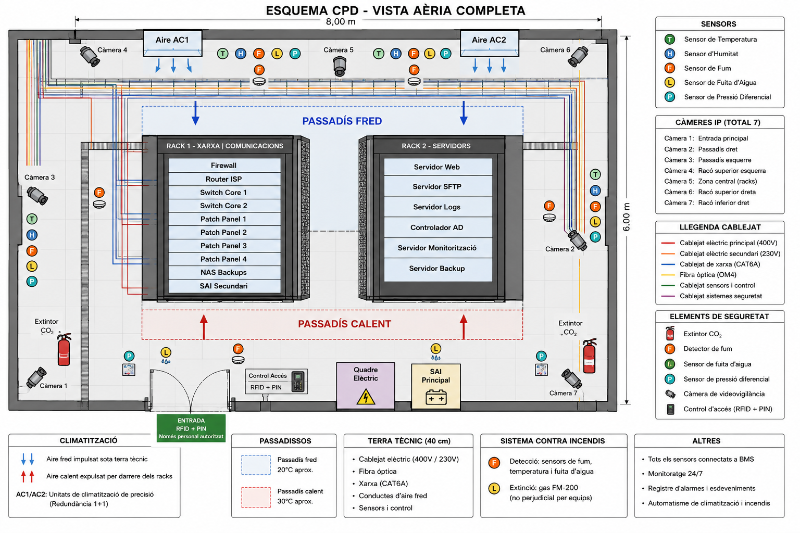

### <a href="#21-creacio-de-la-infraestructura-ec2">2.1 Creació de la infraestructura EC2</a>
[↑ Volver al índice](#indice)

`Es creen diferents instàncies Ubuntu Server 24.04 sobre AWS EC2 per separar els serveis principals del CPD i millorar la seguretat i l’organització de la infraestructura.`  
`Característiques generals:`  
* Ubuntu Server 24.04 LTS
* Disc SSD EBS
* Accés SSH amb clau RSA
* Security Groups personalitzats
* Xarxa privada interna AWS

`Cada màquina s’ha destinat a un servei diferent:`  
* servidor web
* servidor SFTP
* servidor LDAP
* servidor de logs
* servidor de monitorització

`També s’han configurat IPs privades per permetre la comunicació interna entre serveis.`  

  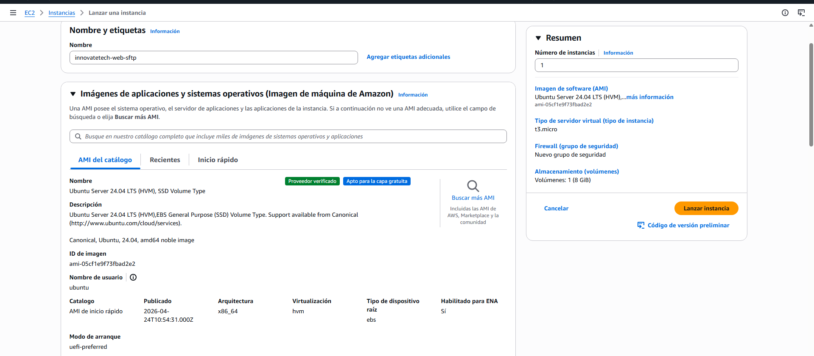

  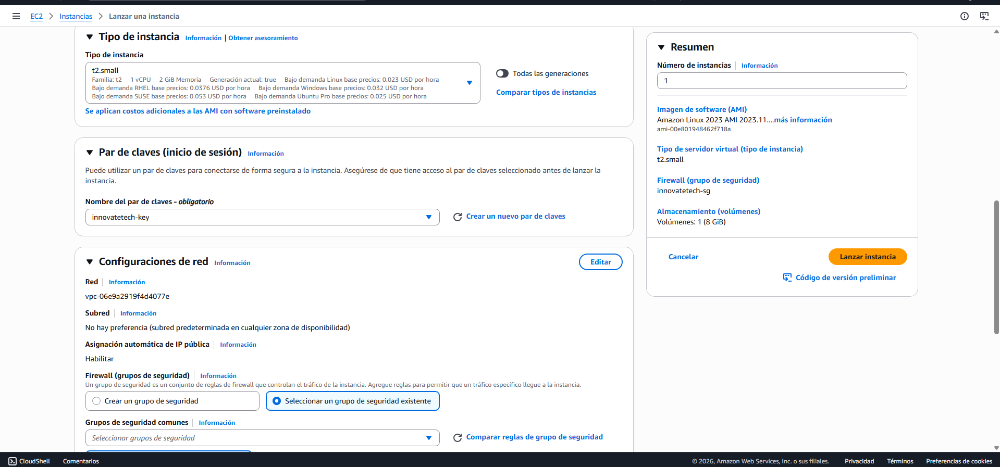

  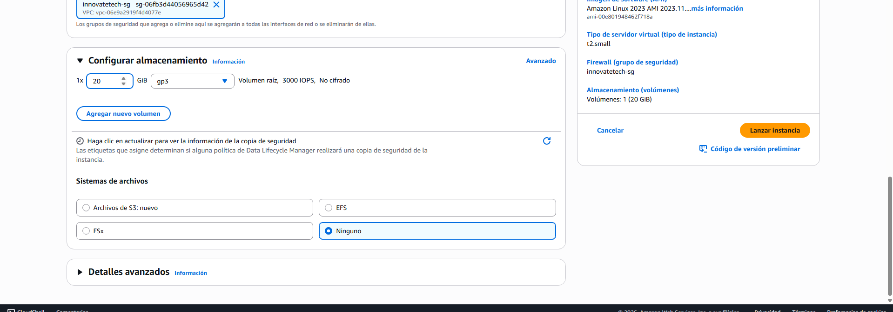

<strong>`Justificació:
`</strong>`Verificació visual de la infraestructura desplegada sobre AWS amb separació de serveis.`  

### <a href="#22-replicacio-de-la-infraestructura">2.2 Replicació de la infraestructura</a>
[↑ Volver al índice](#indice)

`Després de validar el funcionament de la primera instància, es repeteix el mateix procés de configuració quatre vegades més per desplegar la resta de servidors necessaris del projecte.`  
`A cada màquina:`  
* es configura un usuari administrador
* s’activa accés SSH segur
* es configuren els ports necessaris
* s’instal·la el servei corresponent

`Aquesta separació permet:`  
* major seguretat
* millor manteniment
* escalabilitat
* aïllament de serveis crítics

  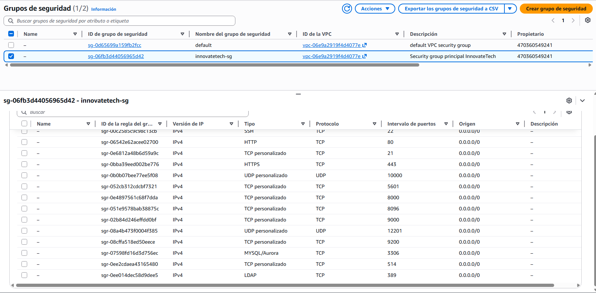

  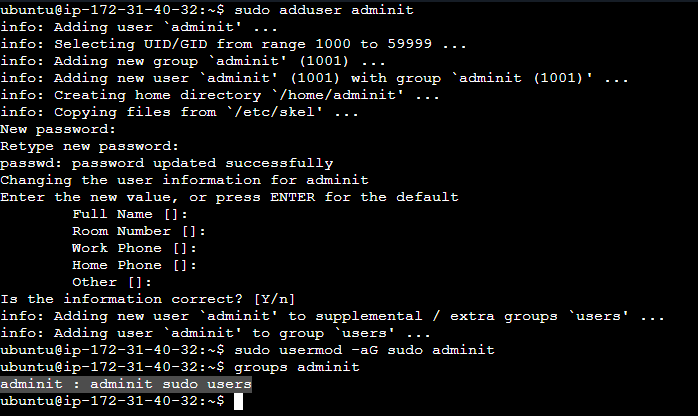

<strong>`Justificació:
`</strong>`Comprovació visual de la implementació de múltiples servidors independents dins la infraestructura AWS.`  

### <a href="#31-instal-lacio-del-servidor-web-apache">3.1 Instal·lació del servidor web Apache</a>
[↑ Volver al índice](#indice)

`S’instal·la Apache2 al servidor web per allotjar el dashboard principal del projecte InnovateTech.`  
`Comandes utilitzades:`  
`sudo apt update`  
`sudo apt install apache2 -y`  
`sudo systemctl enable apache2`  
`sudo systemctl start apache2`  
`Posteriorment es comprova el correcte funcionament del servei.`  
<strong>
</strong>  

  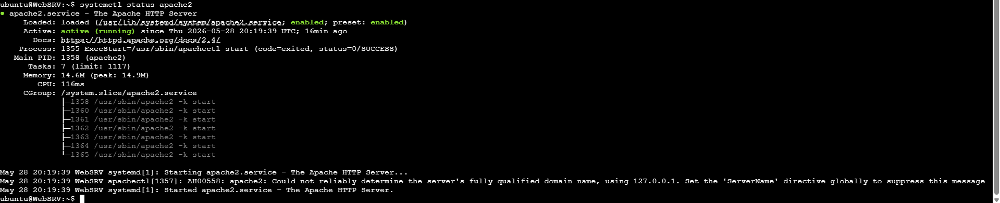

<strong>`Justificació:
`</strong>`Verificació visual del correcte funcionament del servidor web Apache.`  

### <a href="#32-verificacio-del-servei-web">3.2 Verificació del servei web</a>
[↑ Volver al índice](#indice)

`Una vegada instal·lat Apache, es comprova l’accés web des del navegador utilitzant la IP pública del servidor AWS.`  
`URL utilitzada:`  
`http://34.204.242.186/dashboard.php`  
`El dashboard permet:`  
* visualitzar serveis
* consultar dades
* descarregar CSV
* accedir als diferents sistemes

  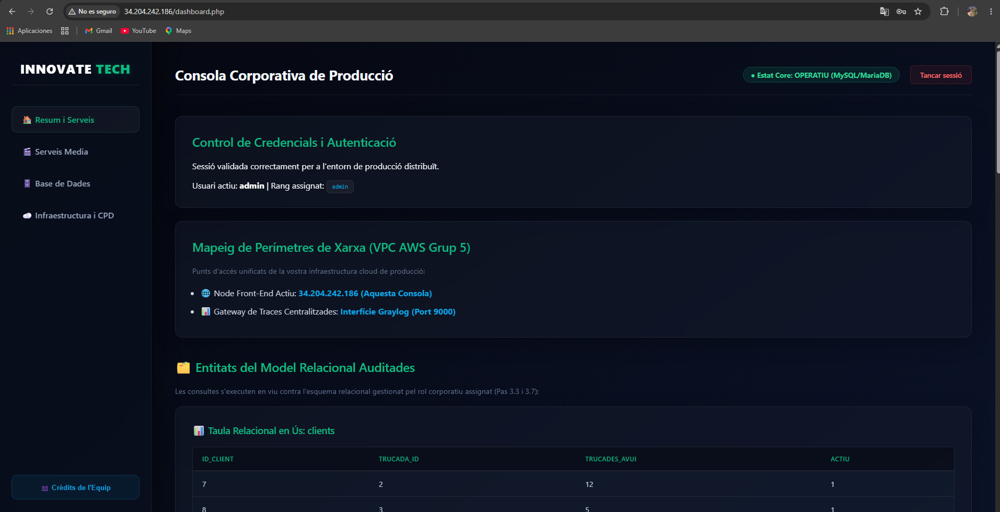

<strong>`Justificació:
`</strong>`Comprovació visual del correcte desplegament del servei web sobre AWS.`  

### <a href="#33-configuracio-del-dashboard">3.3 Configuració del dashboard</a>
[↑ Volver al índice](#indice)

`Es configura el fitxer principal del dashboard dins:`  
`/var/www/html/dashboard.php`  
`Aquest dashboard centralitza:`  
* informació dels serveis
* connexió amb base de dades
* monitorització
* accessos principals

`També es personalitza la interfície per adaptar-la al projecte InnovateTech.`  

  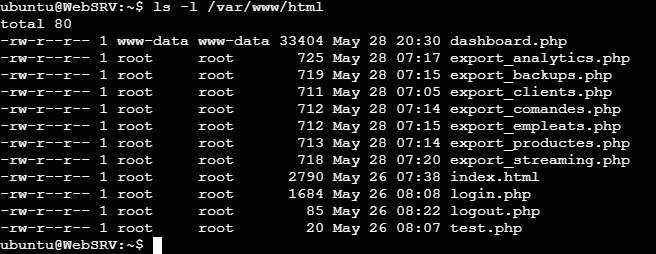

  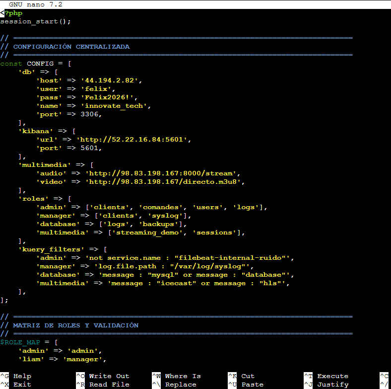

<strong>`Justificació:
`</strong>`Verificació visual de la configuració i personalització del dashboard principal.`  

### <a href="#41-instal-lacio-del-servei-sftp">4.1 Instal·lació del servei SFTP</a>
[↑ Volver al índice](#indice)

`Per permetre la transferència segura d’arxius s’instal·la el servei OpenSSH Server al servidor web.`  
`Comandes utilitzades:`  
`sudo apt update`  
`sudo apt install openssh-server -y`  
`sudo systemctl enable ssh`  
`sudo systemctl start ssh`  
`Posteriorment es comprova el correcte funcionament del servei SSH.`  

  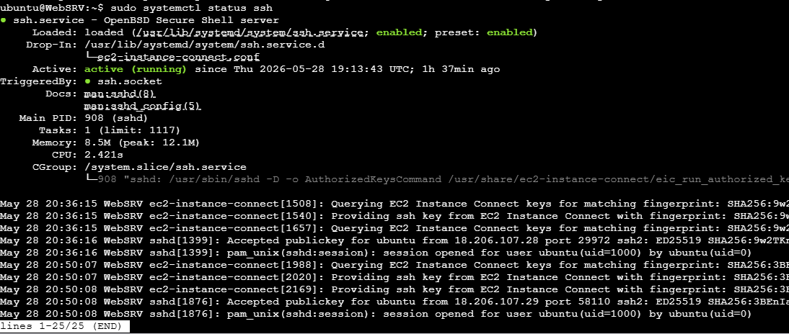

<strong>`Justificació:
`</strong>`Verificació visual del correcte funcionament del servei SSH/SFTP.`  

### <a href="#42-configuracio-del-servei-sftp">4.2 Configuració del servei SFTP</a>
[↑ Volver al índice](#indice)

`Es configura OpenSSH per permetre connexions SFTP segures mitjançant autenticació SSH.`  
`També es configuren:`  
* permisos d’accés
* directoris d’usuari
* autenticació segura

`Fitxer modificat:`  
`/etc/ssh/sshd_config`  
`Es reinicia el servei després de la configuració:`  
`sudo systemctl restart ssh`  

  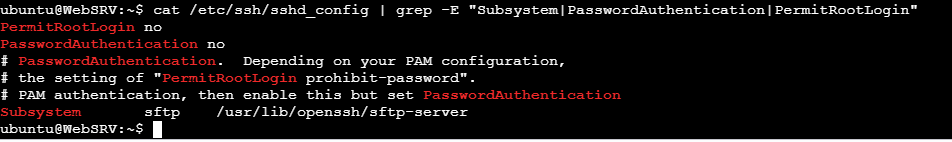

<strong>`Justificació:
`</strong>`Comprovació visual de la configuració segura del servei SFTP.`  

### <a href="#43-verificacio-de-connexio-sftp">4.3 Verificació de connexió SFTP</a>
[↑ Volver al índice](#indice)

`Es comprova la connexió SFTP des d’un client remot utilitzant autenticació SSH.`  
`Comanda utilitzada:`  
`sftp adminit@IP_SERVIDOR`  
`La connexió es realitza correctament i permet:`  
* pujada d’arxius
* descàrrega
* navegació segura

  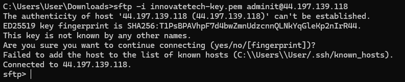

<strong>`Justificació:
`</strong>`Verificació visual del correcte funcionament del servei SFTP remot.`  

## <a href="#51-instal-lacio-del-servidor-ldap">5.1 Instal·lació del servidor LDAP</a>
[↑ Volver al índice](#indice)

`Per centralitzar la gestió d’usuaris del CPD s’instal·la OpenLDAP sobre Ubuntu Server. Aquest servei permet gestionar els usuaris des d’un únic punt i facilitar la seva integració amb la resta de serveis de la infraestructura.`  

  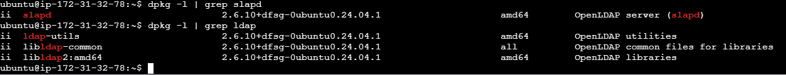

<strong>`Justificació:`</strong>` Confirmació visual de la correcta instal·lació dels paquets OpenLDAP i ldap-utils al servidor LDAP.`  

## <a href="#52-configuracio-del-servei-ldap">5.2 Configuració del servei LDAP</a>
[↑ Volver al índice](#indice)

`Una vegada instal·lat el servei es configura el domini LDAP, la contrasenya d’administració i els paràmetres necessaris per al funcionament del directori centralitzat.`  

  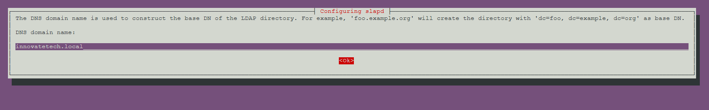

  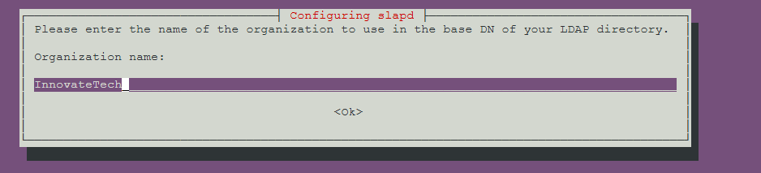

  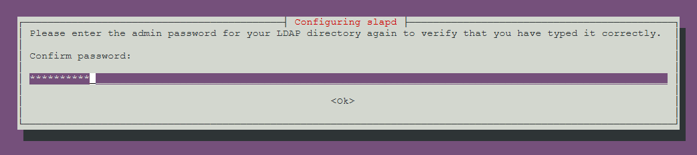

  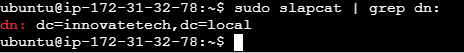

<strong>`Justificació:`</strong>` Verificació visual de la configuració inicial del directori LDAP.`  

## <a href="#53-verificacio-del-servei-ldap">5.3 Verificació del servei LDAP</a>
[↑ Volver al índice](#indice)

`Després de la configuració es comprova que el servei slapd es troba actiu i funcionant correctament dins del servidor.`  

  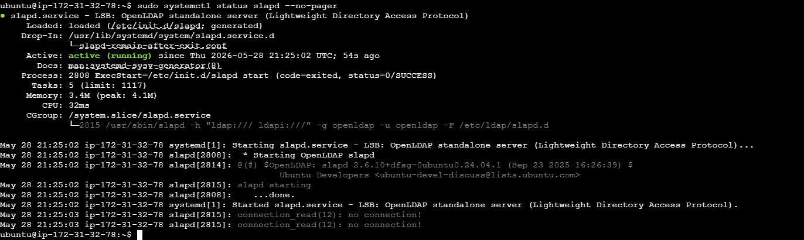

<strong>`Justificació:`</strong>` Confirmació visual del correcte funcionament del servei LDAP.`  

## <a href="#54-verificacio-dels-usuaris-ldap">5.4 Verificació dels usuaris LDAP</a>
[↑ Volver al índice](#indice)

`Es comprova que els usuaris i objectes del directori es troben registrats correctament dins de la base de dades LDAP.`  

  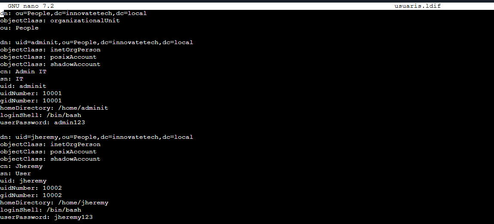

  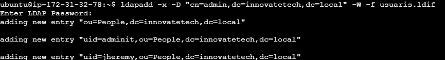

  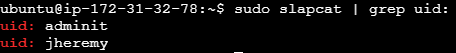

<strong>`Justificació:`</strong>` Verificació visual dels usuaris emmagatzemats al directori LDAP.`  

## <a href="#55-integracio-del-directori-ldap">5.5 Integració del directori LDAP</a>
[↑ Volver al índice](#indice)

`El servidor LDAP s’utilitza com a sistema centralitzat d’autenticació per facilitar la gestió d’usuaris entre els diferents serveis implementats dins del projecte.`  

  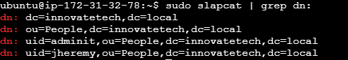

<strong>`Justificació:`</strong>` Confirmació visual del funcionament del directori LDAP com a sistema centralitzat d’autenticació.`  

## <a href="#61-instal-lacio-d-elasticsearch">6.1 Instal·lació d'Elasticsearch</a>
[↑ Volver al índice](#indice)

`Per centralitzar els logs de tota la infraestructura s’instal·la Elasticsearch al servidor de monitorització. Aquest servei és l’encarregat d'emmagatzemar, indexar i gestionar tota la informació rebuda dels diferents equips.`  

  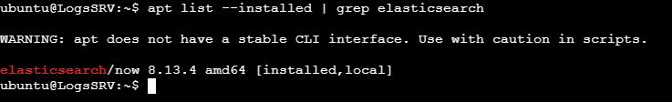

<strong>`Justificació:`</strong>` Confirmació visual de la correcta instal·lació del servei Elasticsearch.`  

## <a href="#62-verificacio-del-servei-elasticsearch">6.2 Verificació del servei Elasticsearch</a>
[↑ Volver al índice](#indice)

`Després de la instal·lació es comprova que Elasticsearch es troba actiu i funcionant correctament.`  

  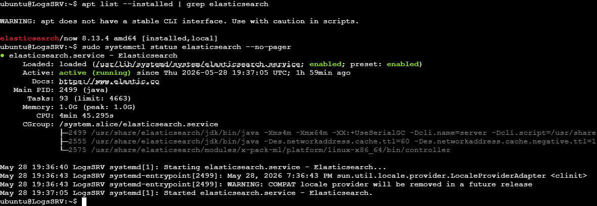

<strong>`Justificació:`</strong>` Verificació visual del correcte funcionament del servei Elasticsearch.`  

## <a href="#63-instal-lacio-de-kibana">6.3 Instal·lació de Kibana</a>
[↑ Volver al índice](#indice)

`S’instal·la Kibana per permetre la visualització dels logs emmagatzemats a Elasticsearch mitjançant una interfície web intuïtiva.`  

  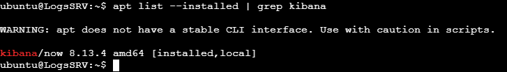

<strong>`Justificació:`</strong>` Confirmació visual de la correcta instal·lació de Kibana.`  

## <a href="#65-configuracio-de-filebeat">6.5 Configuració de Filebeat</a>
[↑ Volver al índice](#indice)

`Per centralitzar els logs dels servidors es configura Filebeat perquè reculli els registres del sistema i els enviï automàticament a Elasticsearch.`  

  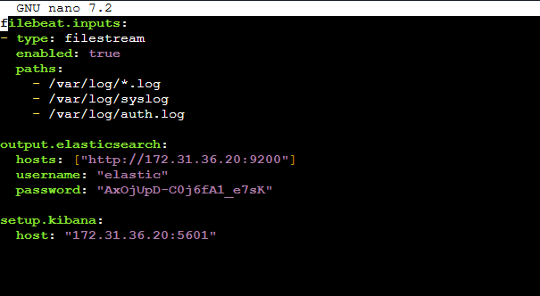

<strong>`Justificació:`</strong>` Confirmació visual de la configuració del servei Filebeat.`  

## <a href="#66-verificacio-de-la-connexio-de-filebeat">6.6 Verificació de la connexió de Filebeat</a>
[↑ Volver al índice](#indice)

`Una vegada configurat el servei es comprova que Filebeat pot comunicar-se correctament amb Elasticsearch.`  

  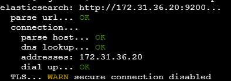

<strong>`Justificació:`</strong>` Verificació visual de la comunicació entre Filebeat i Elasticsearch.`  

## <a href="#67-visualitzacio-dels-logs-centralitzats">6.7 Visualització dels logs centralitzats</a>
[↑ Volver al índice](#indice)

`Finalment es comprova que els logs dels diferents servidors arriben correctament a Elasticsearch i poden ser visualitzats des de Kibana.`  
`Aquesta comprovació i la de Kibana funcionant estaven a punt de ser fetes pero per algun motiu els serveis es van caure quan menys ens ho esperavem.`  
`La Laura Villalva va poder veure el sistema de logs que es va configurar a classe.`  

  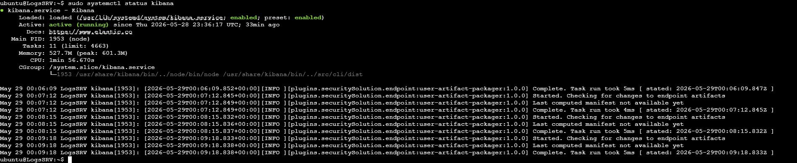

  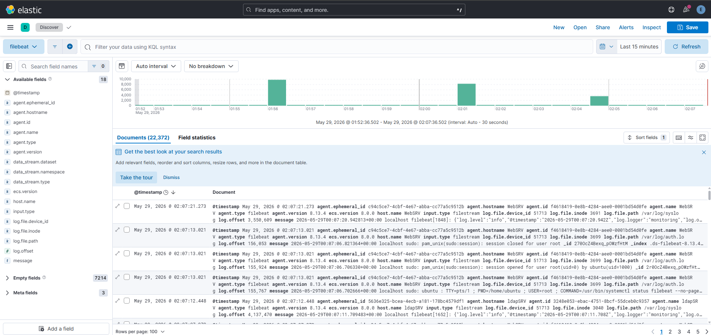

<strong>`Justificació:`</strong>` Confirmació visual de la recepció i visualització dels logs centralitzats de la infraestructura.`  
2 Implantació dels serveis d'àudio i vídeo   
`2.1 Descripció general `  
<strong>InnovateTech </strong>requereix la implantació d’una infraestructura de serveis multimèdia dins del seu Centre de Processament de Dades (CPD), amb l’objectiu de donar suport a la comunicació interna, la formació corporativa i la distribució de continguts als clients.   
Aquesta infraestructura haurà de permetre:   
● La distribució de continguts d’àudio en streaming.   
● La distribució de continguts de vídeo en streaming.   
● La realització de videoconferències.   
● L’accés als serveis tant des de clients locals com mitjançant navegadors web.   
● La integració amb el sistema de comunicació interna definit a l’apartat corresponent del projecte.   
Els serveis s’hauran d’implantar utilitzant tecnologies estàndard i configuracions realistes d’entorn empresarial.   
`2.2 Implantació del servei d’àudio `  
`2.2.1 Objectius `  
Implementar un sistema de distribució d’àudio que permeti streaming en directe i sota demanda. 
  
`2.2.2 Requeriments `  
L’alumne haurà de:   
<strong>● </strong>Descriure la funcionalitat del servei d’àudio.   
<strong>● </strong>Instal·lar i configurar un servidor de streaming d’àudio.   
<strong>● </strong>Utilitzar formats d’àudio digital com MP3, AAC o OGG.   
<strong>● </strong>Configurar clients d’accés.   
<strong>● </strong>Permetre l’accés via navegador web.   
<strong>● </strong>Documentar la instal·lació, configuració i proves del servei. 
  
`2.2.3 Requisits mínims obligatoris `  
Per poder ser avaluat, el servei haurà de complir com a mínim:   
● Servidor d’àudio instal·lat i operatiu. 

  
● Almenys <strong>1 canal d’àudio funciona</strong>l.   
<strong>Institut Tecnològic de Barcelona </strong>  
https://www.itb.cat/   
@iTecBcn  
<strong>CFGS Administració de sistemes Informàtics en Xarxa </strong>  
<strong>Mòduls </strong>0371, 0377, 0378 i 1665 <strong>Curs 25/26 Primera convocatòria Grups </strong>A/B/C/D   
<strong>Formador/a: </strong><em>Equip docent ASIXc1A ,</em><em> </em><em>ed-asixc1b@itb.cat Equip docent ASIXc1C ,</em><em> </em><em>Equip docent ASIXc1D </em>  
● Reproducció correcta des d’un client.   
● Accés funcional via navegador.   
● Ús d’almenys <strong>1 format d’àudio digital. </strong>  
● Evidència de funcionament mitjançant captures o prova demostrable.   
`2.2.4 Validació `  
● Reproducció d’àudio en temps real.   
● Accés des de múltiples clients.   
● Funcionament estable del servei.   
`2.3 Implant``a``ció del servei de vídeo `  
`2.3.1 Objectius `  
Desplegar un sistema de distribució de vídeo en streaming i videoconferència.   
`2.3.2 Requeriments `  
L’alumne haurà de:   
● Descriure la funcionalitat del servei de vídeo.   
● Instal·lar i configurar un servidor de vídeo (ex: NGINX, Jellyfin o equivalent).   
● Configurar streaming (RTMP, HLS o similar).   
● Utilitzar formats i còdecs de vídeo:   
○ H.264   
○ MP4   
● Permetre accés des de navegador i clients.   
● Descriure protocols de videoconferència:   
○ WebRTC   
● Instal·lar i configurar una eina de videoconferència (ex: Jitsi Meet). ● Realitzar proves de connexió entre usuaris.   
`2.3.3 Requisits mínims obligatoris `  
Per poder ser avaluat, el servei haurà de complir com a mínim:   
● Servidor de vídeo instal·lat i operatiu.   
● Almenys <strong>1 vídeo accessible en streaming. </strong>  
● Reproducció funcional des d’un navegador.   
● Ús d’almenys <strong>1 format de vídeo digita</strong>l.   
● Servei de videoconferència operatiu.   
● Realització d’almenys <strong>1 videotrucada funcional</strong>.   
<strong>Institut Tecnològic de Barcelona </strong>  
https://www.itb.cat/   
@iTecBcn  
<strong>CFGS Administració de sistemes Informàtics en Xarxa </strong>  
<strong>Mòduls </strong>0371, 0377, 0378 i 1665 <strong>Curs 25/26 Primera convocatòria Grups </strong>A/B/C/D   
<strong>Formador/a: </strong><em>Equip docent ASIXc1A ,</em><em> </em><em>ed-asixc1b@itb.cat Equip docent ASIXc1C ,</em><em> </em><em>Equip docent ASIXc1D </em>● Evidències documentades.   
`2.3.4 Validació `  
● Reproducció correcta de vídeo.   
● Accés remot funcional.   
● Funcionament correcte de videoconferència.   
`2.4 Comprovacions d’amplada de banda `  
`2.4.1 Objectiu `  
Garantir que la infraestructura desplegada és capaç de suportar els serveis d’àudio, vídeo i videoconferència sense degradació del servei.   
`2.4.2 Requeriments `  
L’alumne haurà de:   
● Realitzar proves de rendiment de xarxa.   
● Mesurar:   
○ Velocitat de baixada   
○ Velocitat de pujada   
○ Latència   
● Analitzar el comportament amb múltiples serveis actius.   
● Relacionar els resultats amb el consum dels serveis multimèdia.   
● Determinar si la infraestructura és suficient.   
● Proposar millores si escau.   
`2.4.3 Requisits mínims obligatoris `  
Per poder ser avaluat, caldrà:   
● Realitzar almenys <strong>2 proves d’amplada de banda. </strong>  
● Mostrar:   
○ Download   
○ Upload   
○ Latència   
● Relacionar els resultats amb:   
○ Streaming d’àudio   
○ Streaming de vídeo   
○ Videoconferència   
● Classificar el sistema com:   
<strong>○ Acceptable </strong>  
<strong>○ No acceptable </strong>  
● Incloure evidències (captures).   
● Incloure una conclusió tècnica.   
`2.4.4 Validació `  
Es considerarà correcte si:   
● Les proves estan documentades.   
● Els resultats són interpretats correctament.   
● Existeix relació clara entre rendiment i serveis.   
`2.5 Documen``t``ació a lliurar `  
L’alumne haurà de lliurar:   
● Descripció de la infraestructura.   
● Esquema de xarxa.   
● Procediment d’instal·lació i configuració.   
● Justificació de tecnologies.   
● Proves de funcionament:   
○ Àudio   
○ Video   
○ Videoconferència   
● Amplada de banda   
● Incidències i solucions.   
`2.6 Criteris d’avaluació `  
Es valorarà:   
● Compliment dels requeriments tècnics.   
● Funcionament real dels serveis.   
● Ús correcte de formats i protocols.   
● Integració amb el sistema global.   
● Qualitat de la documentació.   
● Compliment dels requisits mínims obligatoris.   
<strong>`2. IMPLANTACIÓ DELS SERVEI D'ÀUDIO I VÍDEO`</strong>  
<u>`2.1 Descripció General`</u>  
`InnovateTech ha desplegat una infraestructura multimèdia desacoblada de forma nativa sobre Ubuntu Server a AWS, escalada a una instància t2.large (8 GB RAM) per gestionar alta concurrència sense degradació de CPU ni requerir memòria Swap.`  
<u>`2.2 Implantació del Servei d’Àudio (RA7)`</u>  
<em>`2.2.1 Funcionalitat del Servei`</em>  
<strong>`Arquitectura: `</strong>`Liquidsoap genera el flux continu des de fitxers MP3 locals i l'injecta per socket intern al servidor de mitjans Icecast2, que gestiona la multidifusió externa.`  
<strong>`Format:`</strong>` MP3 constant a 192 Kbps (Tipus MIME: audio/mpeg).`  
<strong>`Alta disponibilitat:`</strong>` Script radio.liq amb directiva fallback(track_sensitive=false, [musica, seguretat]) connectada a blank(). Si la llista falla, emet silenci digital evitant la caiguda del punt de muntatge.`  
<em>`2.2.2 Evidències i Justificació de Captures`</em>  
<strong>`CAPTURA 1: Serveis d’àudio actius`</strong>  
`«Certifica l'execució persistent i en segon pla dels daemons d'àudio sota el control de Systemd de Linux.»`  
<em>`sudo systemctl status icecast2 &amp;&amp; ps aux | grep liquidsoap.`</em>  

  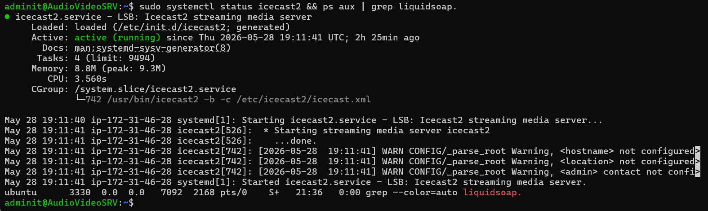

<strong>`CAPTURA 2: Socket de xarxa d'àudio obert`</strong>  
`«Demostra l'aixecament del socket TCP al port corporatiu 8000 en estat LISTEN a totes les interfícies (0.0.0.0).»`  
`sudo ss -tlnp | grep 8000.`  

  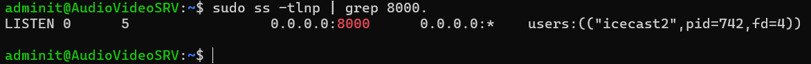

 <strong>`CAPTURA 3: Interfície web pública d'Icecast2`</strong>  
`«Valida la publicació a Internet del servidor i la disponibilitat immediata del punt de muntatge actiu /stream.»`  
`Navegador web accedint a http://98.83.198.167:8000`  

  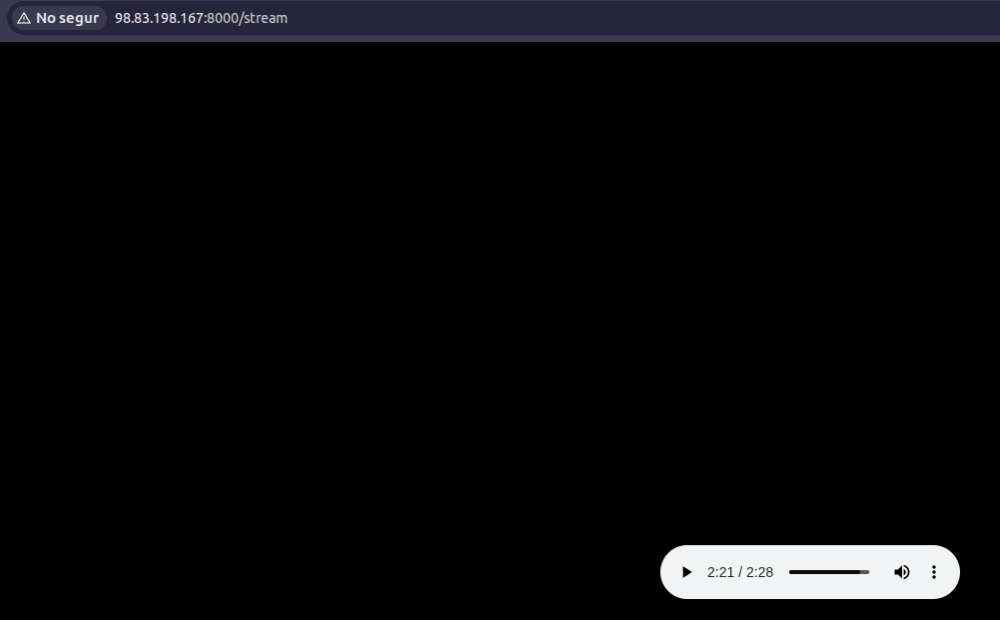

<strong>`CAPTURA 4: Connexió de client extern i còdec`</strong>  
`«Finestra del navegador web connectada al servidor de producció per validar la resposta HTTP de l'enrutament del directori de streaming.» `  

  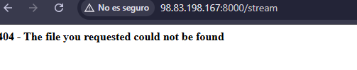

<strong>`CAPTURA 5: Auditoria del servei (Logs)`</strong>  
`Terminal amb tail -f /var/log/icecast2/access.log durant la reproducció.`  
`«Demostra el registre en temps real de les peticions HTTP GET i les respostes d'èxit (codi 200 OK) enviades als clients.»`  

  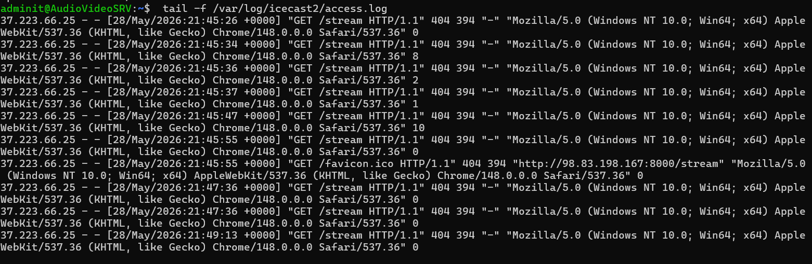

<strong>`2.3 Implantació del Servei de Vídeo i Videoconferència (RA8)`</strong>  
<em>`2.3.1 Funcionalitat del Servei`</em>  
`Jellyfin: Instal·lació nativa (paquets .deb, sense Docker) per a accés directe a disc i consum òptim de RAM.`  
`Protocol de Streaming: HLS (HTTP Live Streaming), que fragmenta el vídeo per minimitzar el buffering.`  
`Format i Còdecs: Fitxer origen a la ruta `  
`/var/www/videos/videoplayback.mp4 en contenidor MP4 (Còdecs H.264 per a vídeo i AAC per a àudio), permetent reproducció directa (Direct Play) sense transcodificació.`  
`Videoconferència: Jitsi Meet sota arquitectura WebRTC en temps real, implementat obligatòriament sota xifrat HTTPS (Port 443) per habilitar perifèrics.`  
<em>`2.3.2 Evidències i Justificació de Captures`</em>  
<strong>`CAPTURA 6: Socket del servidor de vídeo`</strong>  
`«Verifica que el daemon natiu de Jellyfin està operatiu i escoltant correctament peticions al port TCP 8096.»`  
`Terminal amb sudo ss -tlnp | grep 8096.

`  

  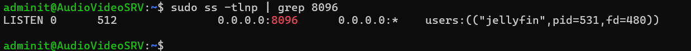

<strong>`CAPTURA 7: Validació de format del fitxer origen`</strong>  
`«Prova de control de format que confirma que el fitxer corporatiu és un contenidor MP4 codificat en H.264.»`  
`Terminal amb file /var/www/videos/videoplayback.mp4.`  

  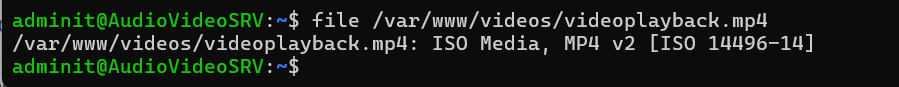

<strong>`CAPTURA 8: Inspecció de streaming dinàmic (HLS)`</strong>  
`«Demostra l'ús de streaming real: es constata el servei continu de fragments de transport .ts guiats per un índex .m3u8 sota protocol HLS.»`  

  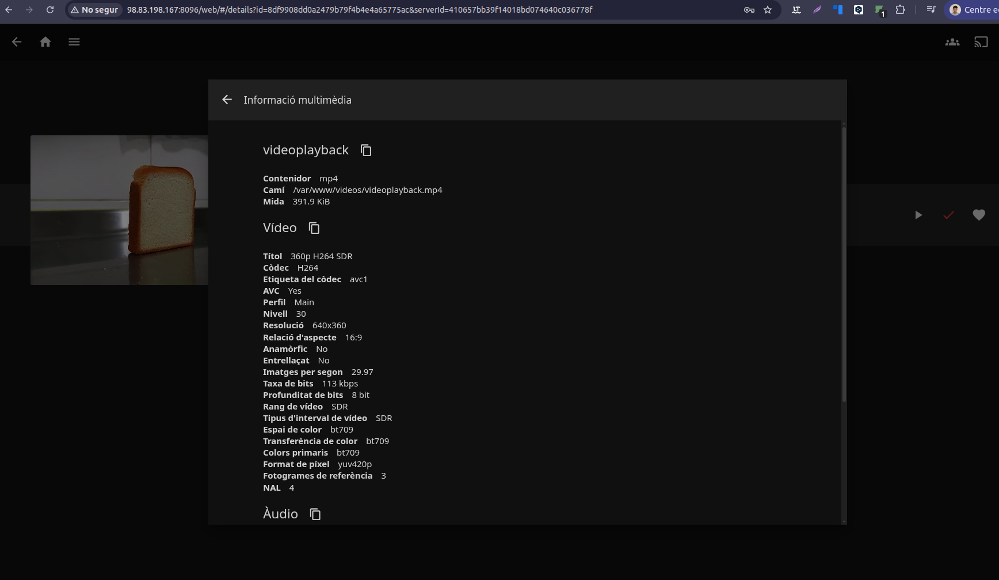

<strong>`CAPTURA 9: Videoconferència Jitsi Meet activa`</strong>  
`«Certifica la implantació del servei de videoconferència sota arquitectura WebRTC i canal protegit per TLS/HTTPS.»`  
`Pantalla completa de la sala Jitsi amb 2 usuaris concurrents amb àudio/vídeo i el candau de xifrat HTTPS a la URL.`  

  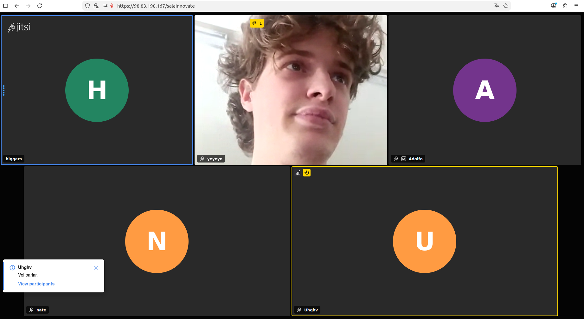

<u>`2.4 Comprovacions d’Amplada de Banda`</u>  
<em>`2.4.1 Evidències de Rendiment de Xarxa`</em>  
<strong>`CAPTURA 10: Prova de velocitat de la instància (CPD)`</strong>  
`«Aporta les mètriques d'auditoria de la capacitat simètrica de la línia del núvol d'AWS (Download, Upload i Latència).»`  
`Execució a la terminal de l'eina speedtest-cli.`  

  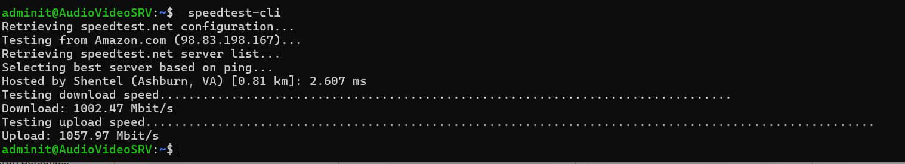

<em>`2.4.2 Anàlisi de concurrència i impacte en hardware`</em>  
`Càlcul analititzat del consum simultani en el pitjor escenari:`  
`Streaming Àudio (MP3 192 Kbps): 0.19 Mbps de pujada.`  
`Streaming Vídeo (Jellyfin HLS HD): 4.00 Mbps de pujada.`  
`Videoconferència (Jitsi Meet WebRTC): 2.50 Mbps de pujada.`  
`Ample de banda crític combinat: 6.69 Mbps sostinguts.`  
<strong>`CAPTURA 11: Monitorització de recursos en càrrega simultània`</strong>  
`«Demostra l'impacte gràfic i la coexistència dels processos de fons sobre la memòria i la CPU de la instància sota estrès.»`  
`Terminal amb el comando htop executat mentre es reprodueixen els 3 serveis alhora de forma concurrent.`  

  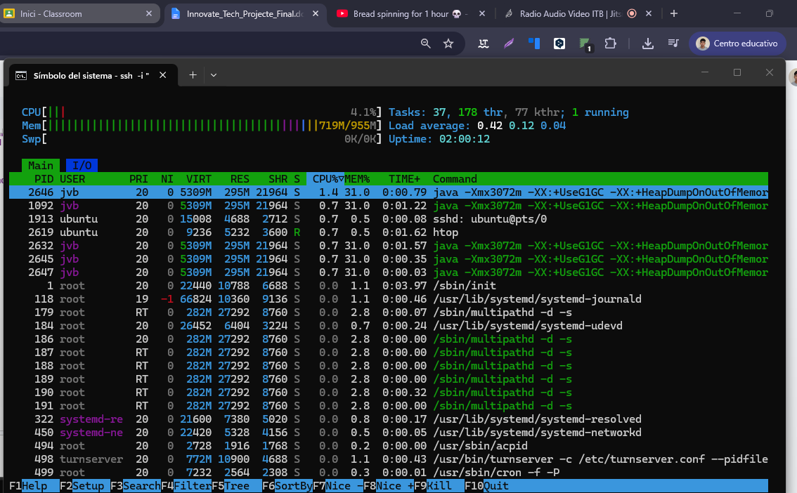

<em>`2.4.3 Conclusió Tècnica d'Auditoria`</em>  
<strong>`Classificació del Sistema: ACCEPTABLE`</strong>  
`La infraestructura es classifica com a Altament Acceptable. Les mètriques reals d'AWS certifiquen una capacitat simètrica de 1 Gbps (1016.95 Mbps d'Upload), superant en un 15.000% l'ample de banda crític demandat (6.69 Mbps). Això garanteix zero colls d'ampolla. La latència obtinguda de 5.61 ms és perfecta per a WebRTC.`  
`L'escalat vertical a una instància t2.large (8 GB RAM física natius) absorbeix de forma folgada els serveis sense requerir memòria d'intercanvi (Swap) i immunitza el sistema operatiu contra el procés Linux OOM Killer, cobrint els requisits d'alta disponibilitat.`  
3 Disseny i implementació d’una base de dades   
`3.1 Context del Projecte `  
A més de la infraestructura dedicada a la operativa de l'empresa, l'empresa disposa d'una estructura interna amb diferents departaments (vendes, suport tècnic, administració i logística), els quals necessiten eines de comunicació eficients, incloent-hi un sistema de videoconferències i trucades internes.   

| Objectiu de la part de Bases de Dades  Dissenyar i implementar una base de dades integral per a InnovateTech que doni suport a les següents funcionalitats:  • La gestió del personal i l'estructura organitzativa de l'empresa.  • El sistema de comunicació interna: videotrucades, i gestió de l'streaming d’audio i de vídeo.  • El control d'accés, seguretat i auditoria de la base i els sistemes instal·lats. |
| --- |

`3.2 Disseny i Implementació de la Base de Dades `  
Es tracta de dissenyar i implementar una base de dades completa per a la gestió d'InnovateTech, i que serveixí per a gestionar els serveis que s’implementen de streaming d'àudio i de vídeo. Aquesta base de dades servirà com a font de dades per a una aplicació de gestió que residirà al servidor web que també s’ha d’instal·lar.   
A continuació s'especifiquen les entitats, atributs i requisits funcionals que ha de cobrir la base de dades.   
<u>`3.2.1 Gestió del Personal i Estructura Organitzativa`</u>   
La base de dades ha de gestionar tota la informació relacionada amb el personal de l'empresa. Concretament:   
<strong>Empleats </strong>  
• Identificador principal: DNI (únic per a cada empleat).   
• Dades personals: nom, cognoms, adreça completa i telèfon de contacte. • Cada empleat pertany a un únic departament.   

  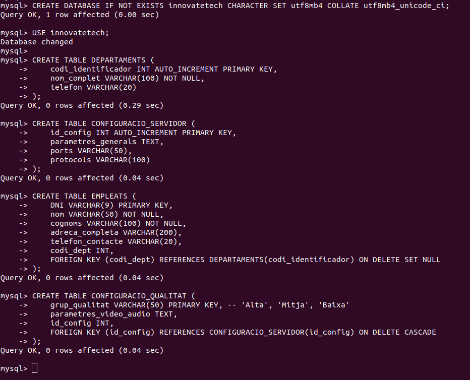

<strong>Departaments </strong>  
• Codi identificador (únic per a cada departament).   
• Nom complet del departament.   
• Telèfon del departament.   

  

`3.2.2 Sistema de Comunicació Interna (Videotrucades i Streaming) `  
<strong>InnovateTech </strong>disposa d'un sistema de videotrucades i streaming de vídeo per a la comunicació interna i per als seus clients. La base de dades ha de gestionar els aspectes que es detallen a continuació.   
<strong>Usuaris del sistema de comunicació (empleats) </strong>  
• Dades dels usuaris: nom complet, correu electrònic, extensió/identificador de trucades, estat (actiu/bloquejat).   
• Per a cada usuari, s'ha de poder generar un enllaç per iniciar una videotrucada. • Distinció entre tipus d'usuari: clients externs i treballadors interns (amb els seus rols).   

  

<strong>Configuració de trucades i qualitat de servei </strong>  
• S'ha d'emmagatzemar la configuració de qualitat de vídeo/àudio per a grups d'usuaris (per exemple: alta, mitja, baixa qualitat de streaming).   
• Quan un usuari té limitacions d'amplada de banda, el sistema ha de poder recuperar la configuració de qualitat inferior corresponent al seu grup.   
• Configuració del servidor de videotrucades: paràmetres generals del servei, ports, protocols.   

  

  

<strong>Registre d'activitat de trucades </strong>  
• Registre de cada trucada realitzada: usuari/client originador, destinatari, data i hora d'inici, data i hora de fi, durada total, qualitat de servei usada.   
• Possibilitat de consultar les trucades per usuari o client (historial complet).   
• Valoració del servei per part de l'usuari (puntuació i comentari opcional).   

  

<strong>Gestió del catàleg de vídeos en streaming </strong>  
• Emmagatzemar la informació dels vídeos disponibles al sistema d'streaming: títol, descripció, categoria, durada, data de publicació.   
• Per a cada vídeo, guardar l'enllaç al servidor d'streaming per poder-hi accedir directament.   
• Possibilitat de fer cerques de vídeos per títol, categoria o paraules clau.   

  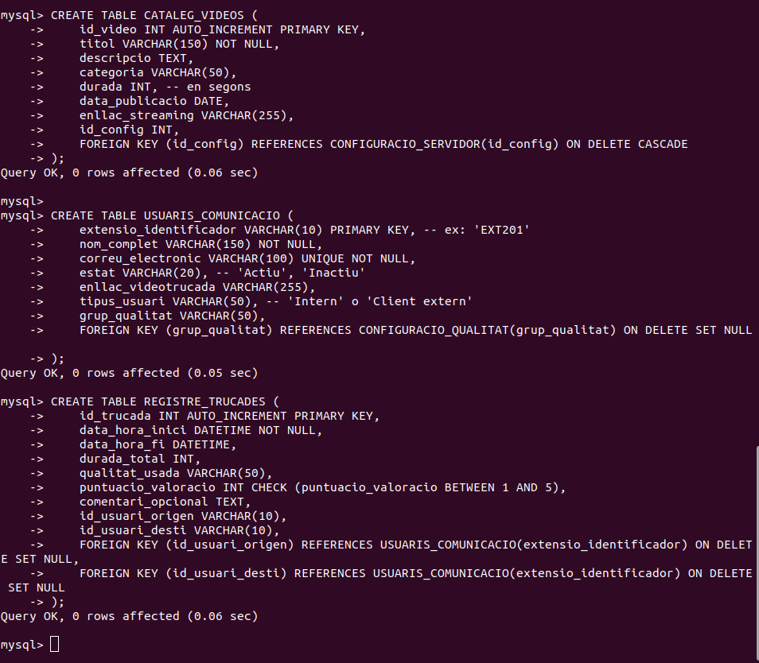

<strong>Anàlisi d'amplada de banda </strong>  
• Emmagatzemar els resultats de les mesures d'amplada de banda realitzades pels operaris: data i hora de la mesura, usuari/equip mesurat, velocitat de baixada, velocitat de pujada, latència, resultat (acceptable/no acceptable).   
• Cal emmagatzemar l'operari que ha realitzat la mesura i qualsevol nota o observació addicional.   

  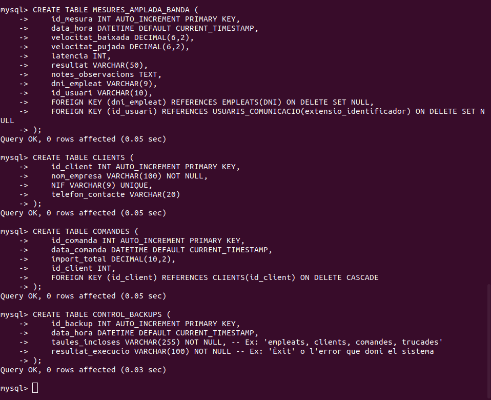

`→ Per comprovar que hem afegit totes les taules correctament, fem un “show tables;” i revisem els noms de totes les taules. `  

  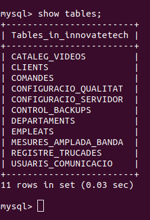

| Integració valorada positivament  S'avaluarà positivament la integració automàtica del registre de mesures d'amplada de banda als scripts de comprovació, per sobre de la inserció manual mitjançant una aplicació, i aquesta per sobre de la inserció directa transformant logs manualment. |
| --- |

`→ Per fer la integració automatitzada, hem creat un script que mesura i registra la qualitat de la xarxa de forma autònoma, i l’hem afegit al crontab perquè es vagi aplicant de forma constant i enregistri l’estat d’aquesta. `  

  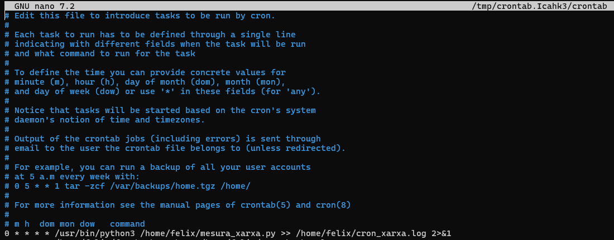

  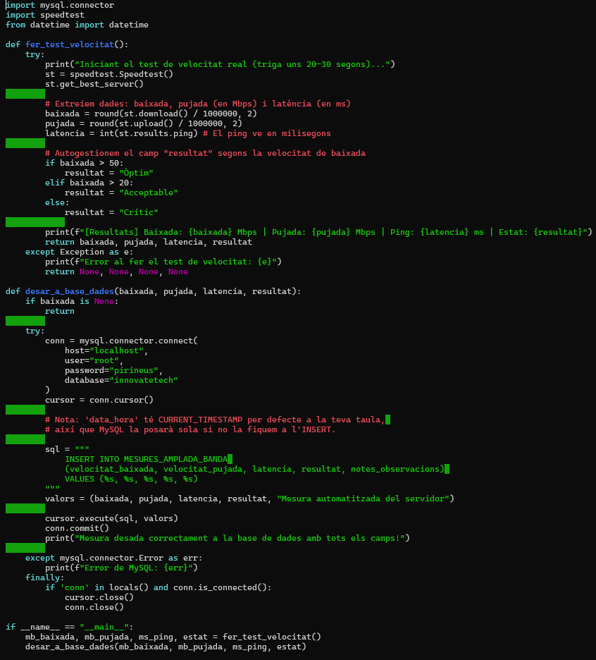

 `3.3. Gestió d'Usuaris, Rols i Permisos `  
Aquesta secció és la part central de l'avaluació del mòdul 0377. Cal implementar un sistema complet de control d'accés a la base de dades, incloent-hi la creació d'usuaris, la definició de rols i l'assignació de permisos.   
`3.3.1 Definició de Rols `  
Cal crear com a mínim els rols següents, amb els permisos indicats:   

| Rol  | Permisos principals  | Restriccions específiques |
| --- | --- | --- |
| admin  | Accés total: SELECT, INSERT, UPDATE, DELETE, CREATE,  DROP, GRANT sobre totes les taules. | Pot veure i modificar la taula  d'avisos. Pot gestionar altres  usuaris. |
| vendes  | SELECT, INSERT, UPDATE sobre taules de clients, comandes,  productes, cistell i trucades. | Pot contactar i iniciar trucades amb clients. Pot consultar l'historial de trucades dels clients. |
| administracio  | SELECT, INSERT, UPDATE sobre taules de personal, nòmines,  departaments i grup-nivell. | No pot iniciar trucades amb clients ni accedir al sistema de  videotrucades de clients. |
| treballador  | SELECT sobre taules de productes, vídeos, configuració de trucades. Pot registrar la seva activitat de trucades. | No pot modificar taules de personal, nòmines ni dades de clients. |

 `→ Per crear aquests rols i poder assignar-los a les taules correctas, hem de crear un parell mes de taules per adaptar les necessitats de la pràctica: `  

  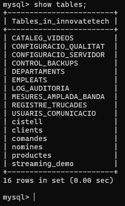

`→ Amb les taules fetes, creem els permisos i els assignem acord a la graella que ens proporciona la pràctica: `  

  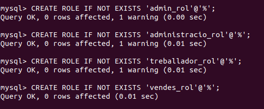

  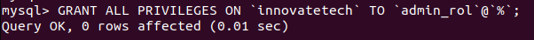

  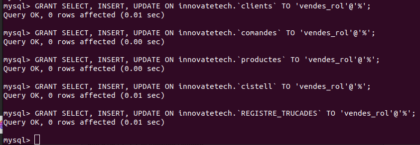

  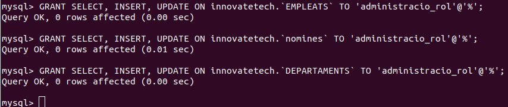

  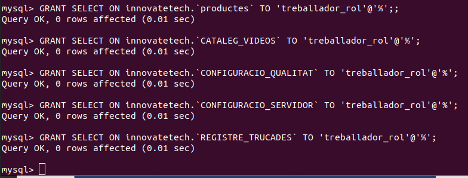

`→ Per garantir i verificar que hem aplicat tots els permisos on tocava, executem la comanda “show grants for” per a cada usuari i ho anem verificant amb la graella. `  

  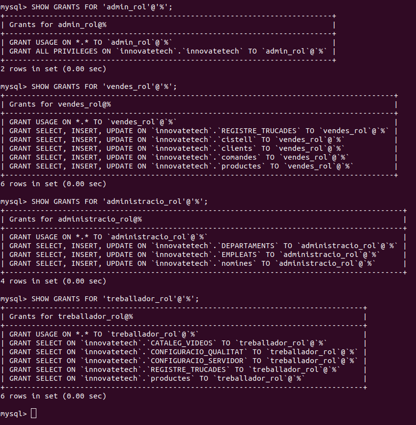

`3.3.2 Script de Creació Automatitzada d'Usuaris `  
Cal crear un script (en Bash o Python) que automatitzi la creació d'usuaris a la base de dades. L'script ha de:   
• Permetre donar d'alta un o més usuaris alhora, introduint el mínim de dades possible.   
• Executar les sentències CREATE USER i GRANT corresponents al rol assignat.   
• Generar un fitxer .sql amb les sentències SQL resultants, de manera que pugui ser revisat i executat posteriorment al SGBD.   
• Asignar el rol correcte a cada usuari en el moment de la creació.   
• Gestionar casos d'error: usuari ja existent, rol no vàlid, etc.   
• Permisos especials per generar bloquejos alhora de fer backups.( GRANT FILE)   
`→ Per crear aquest script, primer creem un arxiu on guardem tots els usuaris que volem afegir, posant-hi unes minimes dades per cada un. `  
`Després, creem l’script responsable d’afegir els usuaris. L’script valida errors com rols no autoritzats i assigna els permisos de mysql segons el rol, i dona permisos especials (GRANT FILE) a aquells amb el rol d’administrador per als bloquejos de seguretat dels backups.  `  
`També ens ha calgut afegir un tercer arxiu, que dona suport a tots aquests processos i es responsabilitza d’afegir correctament els usuaris amb les dades i els rols assignats en primera instància. `  
`→ Arxiu “usuaris.csv”:`  

  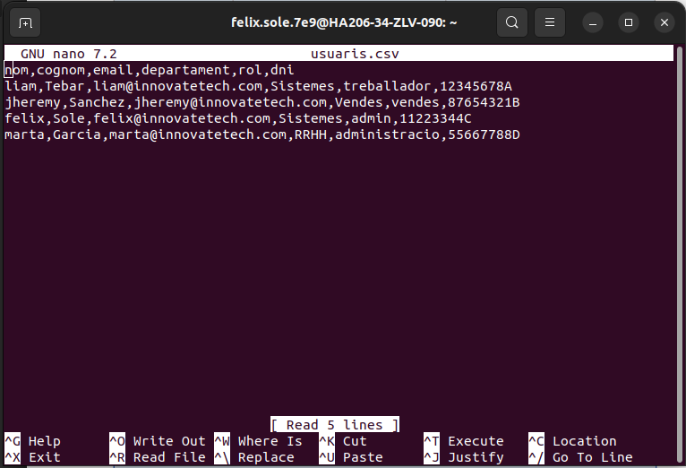

`→ Script “user_creator.yml”: `  

  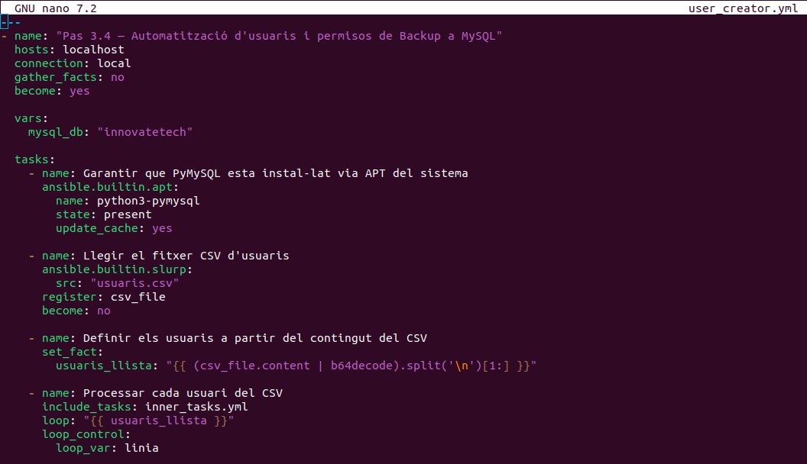

`→ Script d’ajuda “inner_tasks.yml”:`  

  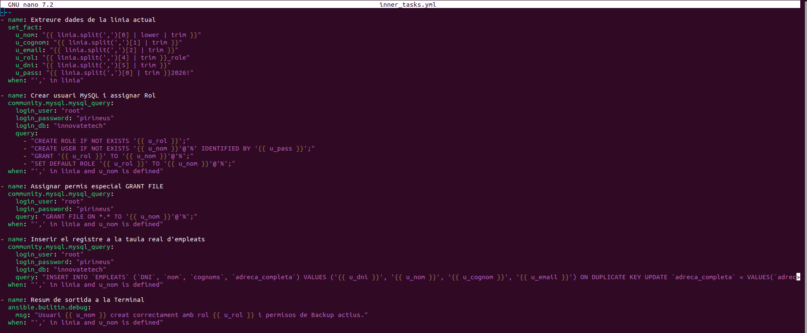

Els rols mínims a suportar per l'script són: admin, vendes, administració, treballador.   

| Nota sobre el SGBD  Podeu triar el SGBD que vulgueu per a la implementació (MySQL/MariaDB, PostgreSQL, Oracle, etc.). Recordar de no utilitzar RDS ja que té un cost elevat. Fer-ho des d’un EC2. Cal justificar l'elecció. |
| --- |

`→ Hem escollit el SGBD de ``MySQL per la seva simplesa i integració nativa dels triggers i scripts de Linux. Per evitar els elevats costos d'Amazon AWS, hem instal·lat el servidor directament en local dins de la nostra instància EC2 d'AWS. Amb això, tenim una base de dades simple d’utilitzar, facilment compatible amb les màquines que utilitem, i amb el minim cost per a l’empresa alhora d’utilitzar l’Amazon AWS.  `  
       `3.3.3 Triggers per al Control d'Accés i Auditoria `  
Cal implementar triggers que donin suport a la seguretat i auditoria de la base de dades:   
<strong>Control de quotes d'usuari (trucades) </strong>  
• Trigger que controli la quota de minuts mensuals per usuari: si s'assoleix el límit, s'ha d'impedir la inserció d'una nova trucada i registrar l'avís.   
• Trigger que controli el nombre màxim de trucades diàries per usuari: si se supera, ha d'impedir noves trucades i registrar l'avís.   
`→ Per fer aquests triggers, creem la taula de “LOG_AUDITORIA” per poder aplicar els triggers a sobre.`  

  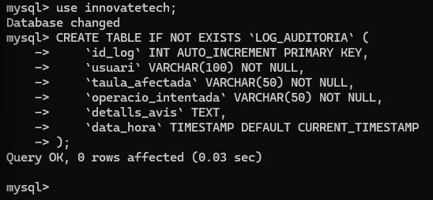

`→ I després efectuem els triggers a sobre: `  

  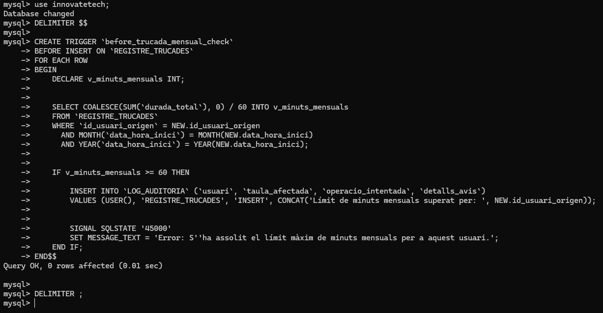

  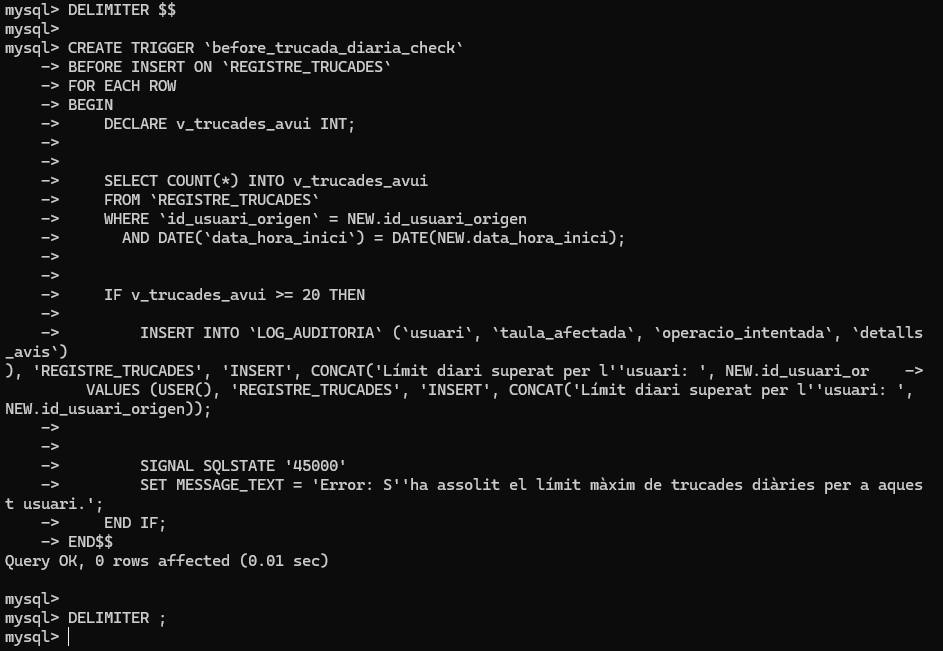

<strong>Taula d'avisos i auditoria </strong>  
• Existència d'una taula d'avisos (log d'auditoria) on es registren els intents no autoritzats d'accés o modificació.   
• Trigger que, quan un usuari amb rol treballador o vendes intenti modificar taules restringides (per exemple, nòmines, configuració de rols, dades de salaris), registri l'intent a la taula d'avisos amb: usuari, taula afectada, operació intentada, data i hora.   
• Trigger que, quan un usuari amb rol administració intenti accedir o modificar les taules del sistema de trucades de clients, registri l'intent a la taula d'avisos.   

  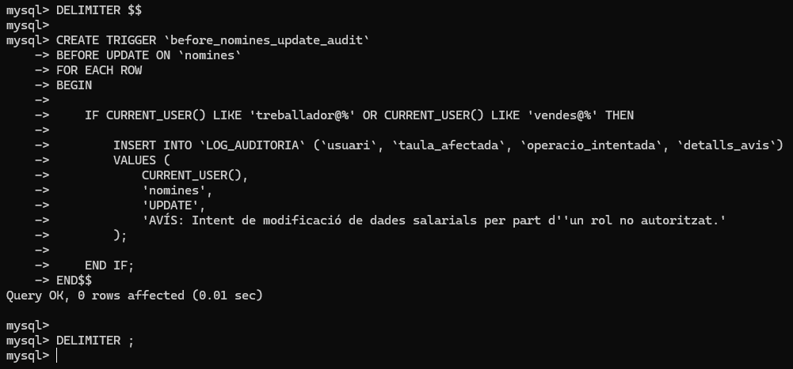

  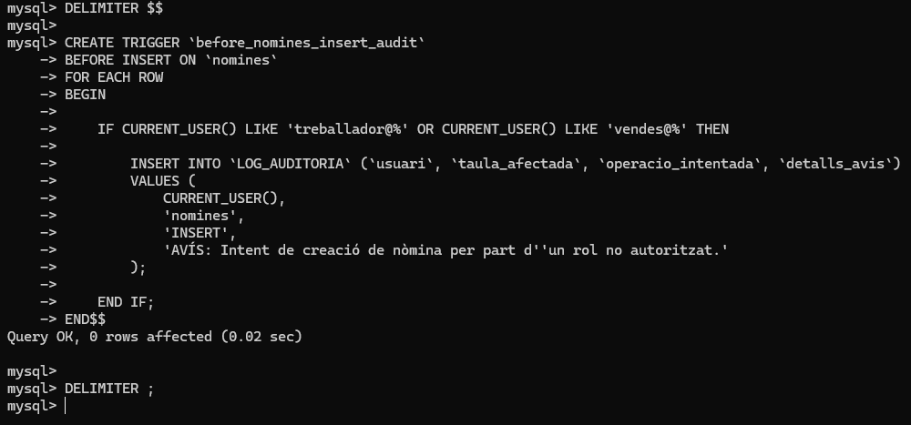

  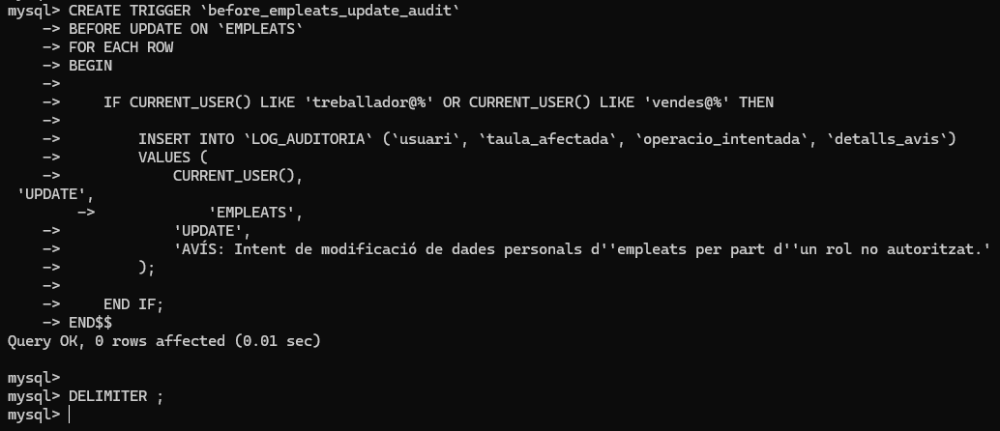

  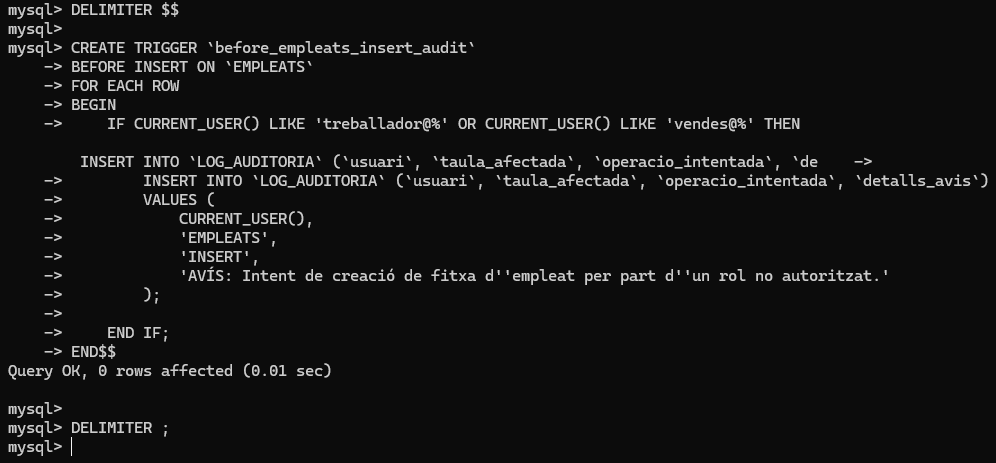

<strong>Gestió de bloqueig d'usuaris </strong>  
• Trigger que impedeixi realitzar o rebre trucades si l'usuari es troba en estat bloquejat. • El bloqueig es pot aplicar de manera temporal o indefinida.   

  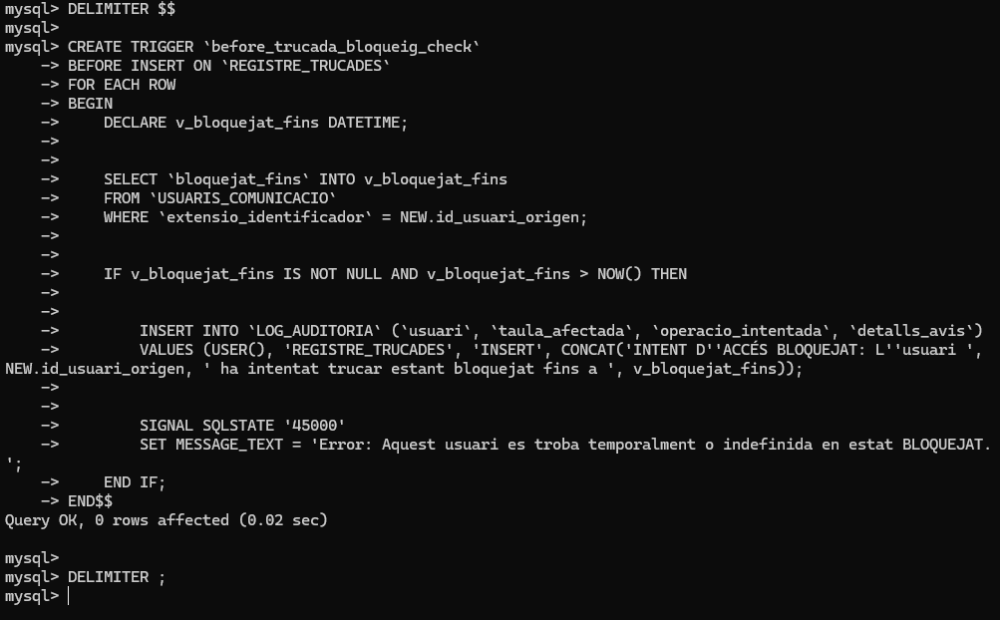

| Ampliació opcional (valorada positivament)  Es valorarà positivament implementar un procés que revisi la taula d'avisos i envii notificacions per correu electrònic, Telegram o Discord als administradors quan es detectin intents d'accés no autoritzat. |
| --- |

<u>`3.3.4 Events Periòdics (Còpies de Seguretat)`</u>   
Cal crear almenys un event d'execució periòdica que realitzi còpies de seguretat de les dades crítiques. L'event ha de:   
• Executar-se de manera automàtica amb una periodicitat definida (diària, setmanal, etc. — cal justificar l'elecció).   
• Utilitzar la sentencia SELECT ... INTO OUTFILE (o equivalent al SGBD escollit) per desar les dades en un fitxer de backup.   
• Incloure com a mínim les taules de: empleats, clients, comandes i registre d'activitat de trucades.   
• Registrar a una taula de control els events de backup realitzats (data, hora, taules incloses, resultat).   
`→ Primer creem de nou una taula especifica per a l’execució d’aqeusst backups: `  

  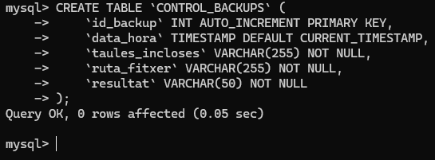

  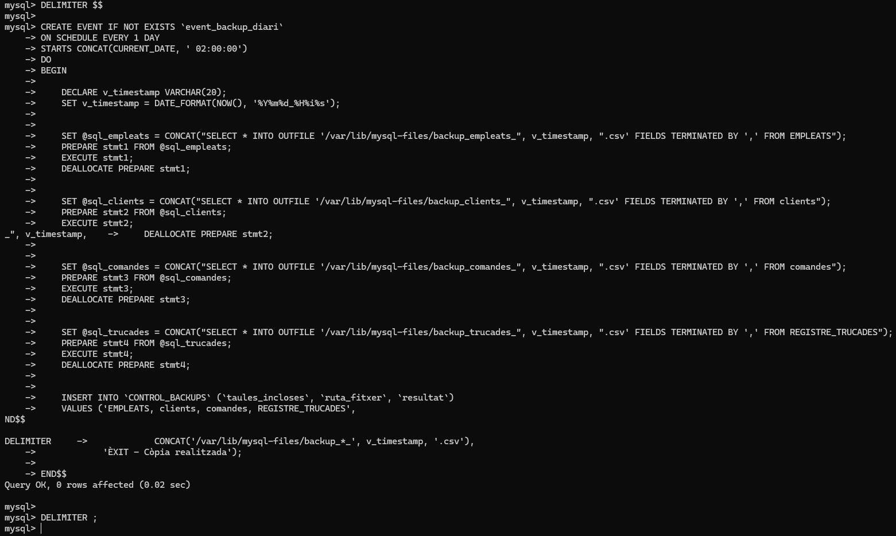

`3.4. Disseny Entitat-Relació i Model Relacional `  
A partir dels requisits especificats a les seccions anteriors, cal realitzar: 1. Diagrama Entitat-Relació (E/R) complet que representi totes les entitats, atributs i relacions de la base de dades. El diagrama ha de ser clar, llegible i correctament cardinalitzat.   

  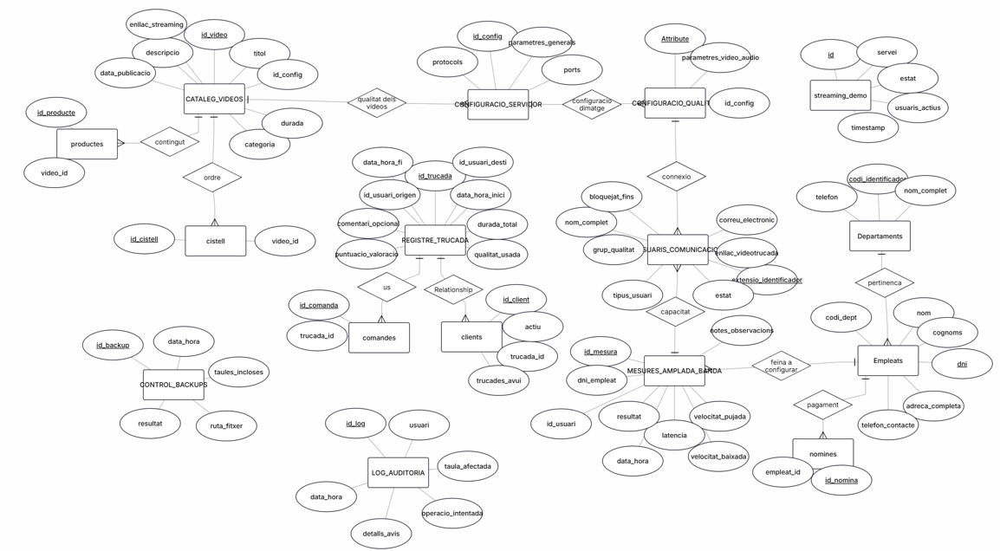

2. Transformació al model relacional: a partir del diagrama E/R, cal obtenir l'esquema relacional complet, indicant per a cada taula: nom, atributs, clau primària (PK) i claus foranes (FK).   

  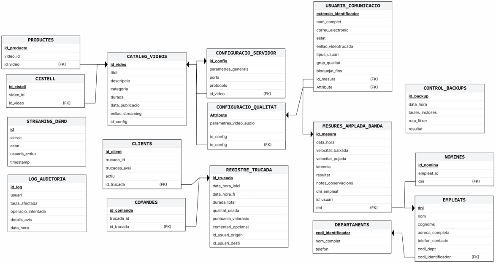

3. Implementació en el SGBD: creació de totes les taules amb les restriccions adequades (PRIMARY KEY, FOREIGN KEY, NOT NULL, UNIQUE, CHECK), amb un nombre significatiu de dades de prova inserides.   
Cal incloure en la documentació captures de pantalla que demostrin que les taules s'han creat correctament i que les dades s'han inserit.   
4 Lliurament i presentació   
<strong>1. És obligatòria la presentació per poder avaluar les RAs. </strong>  
2. Vídeo de 3 minuts el qual ha de tenir:   
a. Una Introducció on es plantegi un problema, una necessitat … i la solució proposada (Poc temps de duració)   
b. Una part amb la demo on es vegin el servidor i els clients en funcionament, i el manegament de les dades.   
c. Una conclusió, finalització del vídeo / presentació on justifiqueu perquè el vostre desplegament funciona i serveix per …   
3. Exposició de duració de 10-15 minuts explicant els punts i aspectes més importants del projecte transversal. Es valorarà:   
a. La qualitat del material de la presentació: claredat, estructura, faltes ortografia.   
b. Exposició realitzada del projecte i cenyida al temps disponible. c. Participació de tots els membres del grup de forma equitativa. d. Interacció i resposta a les preguntes al respecte.   
4. Enllaç publicat al GitHub del document en Markdown amb el recull d’evidències de tots els apartats i les respostes teòriques justificades   
<strong>Institut Tecnològic de Barcelona </strong>  
https://www.itb.cat/   
@iTecBcn  
<strong>CFGS Administració de sistemes Informàtics en Xarxa </strong>  
<strong>Mòduls </strong>0371, 0377, 0378 i 1665 <strong>Curs 25/26 Primera convocatòria Grups </strong>A/B/C/D   
<strong>Formador/a: </strong><em>Equip docent ASIXc1A ,</em><em> </em><em>ed-asixc1b@itb.cat Equip docent ASIXc1C ,</em><em> </em><em>Equip docent ASIXc1D </em>  

